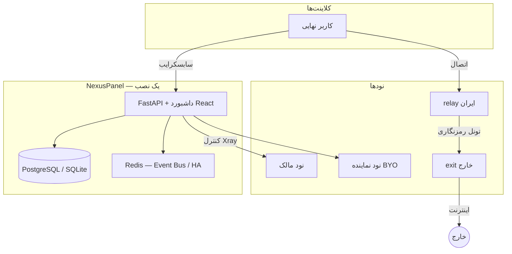

<div align="center">


# NexusPanel

**پلتفرم حرفه‌ای مدیریت پراکسی — چندنود، وایت‌لیبل، آماده فروش**

[](LICENSE)
[](https://www.python.org/)
[](https://fastapi.tiangolo.com/)
[](https://github.com/XTLS/Xray-core)
[](tests/)
[](docker-compose.yml)

[English](./README.md) · **فارسی** · [简体中文](./README-zh-cn.md) · [Русский](./README-ru.md)

[نصب سریع](#-نصب-یکخطی-vps) · [معماری](#-معماری) · [امکانات](#-امکانات-کلیدی) · [امنیت و tests](#-امنیت-و-پوشه-tests-روی-گیتهاب) · [مخزن](https://github.com/KhaJehAmiri/nexuspanel)

</div>

---

## فهرست

- [NexusPanel چیست؟](#nexuspanel-چیست)
- [نصب یک‌خطی (VPS)](#-نصب-یکخطی-vps)
- [معماری](#-معماری)
- [امکانات کلیدی](#-امکانات-کلیدی)
- [وایت‌لیبل و نمایندگی](#-وایتلیبل-و-نمایندگی)
- [تونل ایران ↔ خارج](#-تونل-ایران--خارج)
- [پیش‌نیاز](#-پیشنیاز)
- [توسعه محلی](#-توسعه-محلی)
- [Docker تولید](#-docker-تولید)
- [تنظیمات](#-تنظیمات)
- [امنیت و پوشه `tests` روی گیت‌هاب](#-امنیت-و-پوشه-tests-روی-گیتهاب)
- [لایسنس](#-لایسنس)

---

## NexusPanel چیست؟

پنل کنترل **تمام‌عیار** برای زیرساخت Xray: از مدیریت کاربر و نود تا **فروش، ریسلر، HA، اتوماسیون و تحلیل ترافیک** — در یک محصول واحد با داشبورد مدرن React.

| برای چه کسی؟ | چه مشکلی حل می‌کند؟ |
|--------------|---------------------|
| ارائه‌دهنده سرویس (ISP/VPN) | چند نود، مانیتورینگ، failover |
| فروشنده / ریسلر | وایت‌لیبل، کیف پول، نود اختصاصی با تخفیف |
| تیم فنی | API v2، Rule Engine، Workflow، پلاگین |

> قابلیت‌های پیشرفته پیش‌فرض **خاموش** هستند — از **System → Feature flags** (`/dashboard/#/system`) یا API setup روشن می‌شوند.

---

## نصب یک‌خطی (VPS)

روی **اوبونتو / دبیان** تازه، با کاربر **root**:

```bash
bash <(curl -fsSL https://raw.githubusercontent.com/KhaJehAmiri/nexuspanel/master/scripts/nexuspanel.sh) install
```

همین. روی VPS کم‌رم (مثلاً ۲GB) اسکریپت خودش swap می‌سازد و پنل را نصب می‌کند.

<details>
<summary><strong>اسکریپت نصب چه کار می‌کند؟</strong></summary>

| مرحله | عملیات |
|--------|--------|
| 1 | نصب Docker و git؛ در صورت کم‌بود RAM، swap خودکار |
| 2 | Clone از `KhaJehAmiri/nexuspanel` → `/opt/nexuspanel` |
| 3 | کپی `xray_config.json` به `/var/lib/nexuspanel` |
| 4 | ساخت `.env` (`UVICORN_HOST=0.0.0.0`، رمز ادمین، JWT) |
| 5 | باز کردن پورت پنل در UFW (در صورت نصب بودن) |
| 6 | Build و اجرای پنل؛ انتظار برای API (migration اول) |
| 7 | Build ایمیج `nexuspanel/node` (روی VPS کم‌رم اختیاری/بعداً) |
| 8 | چاپ آدرس داشبورد، یوزر و پسورد ادمین |

</details>

**بعد از نصب**

| مورد | آدرس / دستور |
|------|----------------|
| داشبورد | `http://SERVER_IP:8000/dashboard/` |
| System / Feature flags | `http://SERVER_IP:8000/dashboard/#/system` |
| مدیریت | `nexuspanel status` · `logs` · `update` · `backup` |

---

## معماری



---

## امکانات کلیدی

<table>
<tr>
<th>لایه</th>
<th>امکانات</th>
<th>وضعیت</th>
</tr>
<tr>
<td><strong>هسته</strong></td>
<td>کاربر، اینباند، هاست، نود، سابسکرایب، تلگرام</td>
<td>پایدار</td>
</tr>
<tr>
<td><strong>زیرساخت</strong></td>
<td>PostgreSQL، Event Bus، بکاپ، Feature Flag، لاگ JSON</td>
<td>فاز ۰</td>
</tr>
<tr>
<td><strong>عملیات</strong></td>
<td>Prometheus، Grafana، Rule Engine، پلاگین، Webhook</td>
<td>فاز ۱</td>
</tr>
<tr>
<td><strong>کلاستر</strong></td>
<td>Auto-heal، bootstrap نود، failover، OpenTelemetry</td>
<td>فاز ۲</td>
</tr>
<tr>
<td><strong>تجاری</strong></td>
<td>RBAC، پلن، کیف پول، فاکتور، API v2</td>
<td>فاز ۳</td>
</tr>
<tr>
<td><strong>مقیاس</strong></td>
<td>HA Leader، Smart Routing، Workflow</td>
<td>فاز ۴</td>
</tr>
<tr>
<td><strong>هوشمندی</strong></td>
<td>تشخیص مصرف غیرعادی، پیش‌بینی اتمام حجم، Marketplace</td>
<td>فاز ۵</td>
</tr>
<tr>
<td><strong>وایت‌لیبل</strong></td>
<td>Tenant، برند، نود SSH، تونل relay/exit، نصب یک‌خطی</td>
<td>فاز ۶</td>
</tr>
</table>

---

## وایت‌لیبل و نمایندگی

یک نصب پنل → **چند نماینده** با برند جدا، **بدون سرور دوم اجباری**:

| قابلیت | توضیح |
|--------|--------|
| **حساب نماینده** | ورود با نام کاربری/رمز؛ کاربر، نود و کیف پول محدود به نماینده |
| **زیرنماینده** | ساخت حساب فرزند با سهمیه + **درصد کمیسیون** برای والد |
| **Tenant** (اختیاری) | جداسازی پیشرفته وایت‌لیبل برای پلن/نود |
| **Branding** | لوگو، رنگ، عنوان پنل، لینک پشتیبانی، دامنه اختصاصی |
| **نود با IP+پسورد** | نماینده سرور خودش را می‌دهد؛ پنل agent را نصب می‌کند |
| **تخفیف BYO** | ترافیک روی نود خود نماینده ارزان‌تر حساب می‌شود |
| **پلن و مالی** | پلن اختصاصی نماینده، شارژ کیف، صورتحساب مصرف GB |
| **درگاه پرداخت** | Demo + **Stripe Checkout** (کلیدها و webhook از UI) |
| **پورتال کاربر** | تمدید خودکار کاربر نهایی در `/portal/` |
| **داشبورد مالک** | MRR، شناوری کیف پول، برترین نمایندگان در Overview |
| **راه‌اندازی اولیه** | ویزارد برای نماینده تازه (برند → پلن → کاربر) |

### تنظیمات تجاری (از UI)

مالک پلتفرم همه تنظیمات مالی را از داشبورد مدیریت می‌کند — **بدون ویرایش `.env`**:

| مسیر | چه چیزی |
|------|---------|
| **System → Commercial / تجاری** | نرخ GB، آستانه کمبود کیف، فاصله job |
| **Billing → Settings / تنظیمات** | همان فرم (میانبر sudo) |
| **بخش Payment** | درگاه دمو، حداقل/حداکثر مبلغ، کلیدهای Stripe |
| **بخش Reseller** | حداکثر زیرنماینده، کمیسیون پیش‌فرض |

آدرس webhook استرایپ: `https://YOUR_PANEL/api/billing/webhook/stripe`

فیچرها را روشن کنید: `billing`, `user_portal`, `white_label`, `node_provisioning` (و `tenants` برای جداسازی پیشرفته).

متغیرهای `.env` مثل `USAGE_BILLING_RATE_PER_GB` فقط **fallback** هستند تا در UI مقداردهی شوند.

---

## تونل ایران ↔ خارج

برای پروتکل‌هایی که **مستقیم** از ایران به سرور خارج پایدار نیستند:

```text
کلاینت  →  نود relay (ایران)  →  تونل Reality/WS/gRPC  →  نود exit (خارج)  →  اینترنت
```

تعریف تونل در پنل → ساخت خودکار قطعات Xray برای relay و exit.

---

## پیش‌نیاز

| محیط | نیازمندی |
|--------|-----------|
| **VPS نصب** | لینوکس، root، پورت 8000 باز، 2GB+ RAM پیشنهادی |
| **توسعه** | Python 3.10+، Xray (یا stub در تست) |
| **تولید** | PostgreSQL 14+، Redis 7+ (برای HA) |

---

## توسعه محلی

```bash
git clone https://github.com/KhaJehAmiri/nexuspanel.git
cd nexuspanel
python3 -m venv .venv && source .venv/bin/activate
pip install -r requirements.txt
cp .env.example .env
alembic upgrade head
python3 main.py
```

```bash
python3 nexuspanel-cli.py admin create --sudo
python3 -m pytest -q
```

---

## Docker تولید

```bash
docker compose -f docker-compose.postgres.yml up -d --build
docker compose -f docker-compose.monitoring.yml up -d
```

داده: `/var/lib/nexuspanel`

---

## تنظیمات

| متغیر | کاربرد |
|--------|--------|
| `SQLALCHEMY_DATABASE_URL` | SQLite (dev) / PostgreSQL (prod) |
| `REDIS_URL` | Event Bus + HA |
| `NODE_BOOTSTRAP_TOKEN` | ثبت خودکار نود |
| `NODE_AGENT_IMAGE` | ایمیج نود (`nexuspanel/node:latest`) |
| `PANEL_PUBLIC_ADDRESS` | آدرس عمومی برای نودهای نماینده |
| `HA_ENABLED` | چند instance پنل |
| `USAGE_BILLING_RATE_PER_GB` | نرخ GB پیش‌فرض (در UI **System → تجاری** بازنویسی می‌شود) |
| `PAYMENT_DEMO_ENABLED` | fallback درگاه دمو |
| `SUB_RESELLER_MAX_PER_PARENT` | fallback حداکثر زیرنماینده |

تنظیمات تجاری (Stripe، نرخ، کمیسیون) در جدول `platform_settings` و از داشبورد قابل ویرایش است.

جزئیات: [`.env.example`](.env.example)

---

## امنیت و پوشه `tests` روی گیت‌هاب

### مخزن عمومی نصب

**سوئیت کامل pytest، اسکریپت‌های e2e و مستندات handoff داخلی روی سرور توسعه می‌مانند** — در `.gitignore` هستند و به این مخزن عمومی push نمی‌شوند (مثل Marzban/3x-ui).

| سوال | پاسخ |
|------|------|
| آیا tests روی گیت‌هاب است؟ | **خیر** — فقط روی کلون خصوصی/لوکال اجرا کنید |
| آیا رمز یا `.env` در درخت عمومی است؟ | **خیر** — هرگز `.env` واقعی، dump یا کلید commit نکنید |
| GitHub Actions چه می‌کند؟ | **Lint + مایگریشن Alembic** روی PostgreSQL |

جزئیات: [SECURITY.md](SECURITY.md) · [docs/LOCAL_SECRETS.md](docs/LOCAL_SECRETS.md)

**هرگز commit نکنید:** `.env` واقعی، dump دیتابیس، کلید TLS خصوصی، IP/رمز سرور در اسکریپت‌ها (همه در `.gitignore` هستند).

---

## لایسنس

این پروژه تحت **[AGPL-3.0](LICENSE)** منتشر شده است (مشتق از اکوسیستم Xray/Marzban-class panels). استفاده شبکه‌ای (SaaS) نیازمند رعایت شرایط AGPL برای کاربران نهایی است.

---

## مشارکت

[CONTRIBUTING.md](CONTRIBUTING.md) — Issues و PR: [github.com/KhaJehAmiri/nexuspanel](https://github.com/KhaJehAmiri/nexuspanel)
