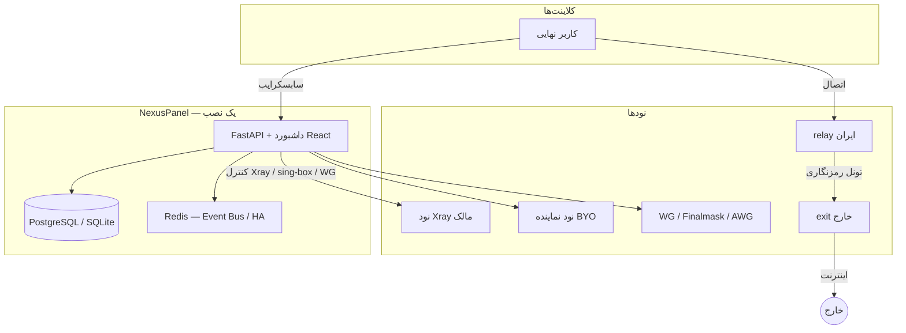

<div align="center">


# NexusPanel

**پلتفرم حرفه‌ای مدیریت پراکسی — چندنود، چندپروتکل، وایت‌لیبل، آماده فروش**

[](VERSION)
[](LICENSE)
[](https://www.python.org/)
[](https://fastapi.tiangolo.com/)
[](https://github.com/XTLS/Xray-core)
[](docker-compose.yml)

[English](./README.md) · **فارسی** · [简体中文](./README-zh-cn.md) · [Русский](./README-ru.md)

[نصب سریع](#-نصب-یکخطی-vps) · [معماری](#-معماری) · [امکانات](#-امکانات-کلیدی) · [پروتکل‌ها](#-پروتکلها-و-سابسکرایب) · [امنیت](#-امنیت-و-پوشه-tests-روی-گیتهاب) · [مخزن](https://github.com/KhaJehAmiri/nexuspanel)

</div>

---

## فهرست

- [NexusPanel چیست؟](#nexuspanel-چیست)
- [نصب یک‌خطی (VPS)](#-نصب-یکخطی-vps)
- [معماری](#-معماری)
- [امکانات کلیدی](#-امکانات-کلیدی)
- [پروتکل‌ها و سابسکرایب](#-پروتکلها-و-سابسکرایب)
- [تونل ایران ↔ خارج](#-تونل-ایران--خارج)
- [مقیاس Finalmask](#-مقیاس-finalmask-وایرگارد-بومی-xray)
- [وایت‌لیبل و نمایندگی](#-وایتلیبل-و-نمایندگی)
- [عملیات و مانیتورینگ](#-عملیات-و-مانیتورینگ)
- [پیش‌نیاز](#-پیشنیاز)
- [توسعه محلی](#-توسعه-محلی)
- [Docker تولید](#-docker-تولید)
- [تنظیمات](#-تنظیمات)
- [امنیت و پوشه `tests`](#-امنیت-و-پوشه-tests-روی-گیتهاب)
- [لایسنس](#-لایسنس)

---

## NexusPanel چیست؟

پنل کنترل **تمام‌عیار** برای Xray، WireGuard و sing-box: از مدیریت کاربر و نود تا **فروش، ریسلر، HA، اتوماسیون و تحلیل ترافیک** — با داشبورد مدرن React (فارسی / انگلیسی / روسی / چینی).

| برای چه کسی؟ | چه مشکلی حل می‌کند؟ |
|--------------|---------------------|
| ارائه‌دهنده سرویس | چند نود، مانیتورینگ، failover، تونل مناسب ایران |
| فروشنده / ریسلر | وایت‌لیبل، کیف پول، نود اختصاصی با تخفیف |
| تیم فنی | API v2، Client API، Rule Engine، Workflow، پلاگین |

> قابلیت‌های پیشرفته پیش‌فرض **خاموش** هستند — از **System → Feature flags** روشن کنید.  
> پیش‌فرض روشن: `tunneling`، `smart_routing`، `setup_wizard`.

---

## نصب یک‌خطی (VPS)

روی **اوبونتو / دبیان** تازه، با کاربر **root**:

```bash
bash <(curl -fsSL https://raw.githubusercontent.com/KhaJehAmiri/nexuspanel/master/scripts/nexuspanel.sh) install
```

<details>
<summary><strong>اسکریپت نصب چه کار می‌کند؟</strong></summary>

| مرحله | عملیات |
|--------|--------|
| 1 | نصب Docker و git؛ در صورت کم‌بود RAM، swap خودکار |
| 2 | Clone از `KhaJehAmiri/nexuspanel` → `/opt/nexuspanel` |
| 3 | ساخت `.env` (رمز ادمین، JWT، توکن bootstrap) |
| 4 | Build و اجرای پنل با Docker Compose (پیش‌فرض PostgreSQL) |
| 5 | Build ایمیج `nexuspanel/node` برای provisioning با SSH |
| 6 | چاپ آدرس داشبورد و اعتبار ادمین |

</details>

| مورد | آدرس / دستور |
|------|----------------|
| داشبورد | `http://SERVER_IP:8000/dashboard/` |
| Feature flags | `http://SERVER_IP:8000/dashboard/#/system` |
| مدیریت | `nexuspanel status` · `logs` · `update` · `backup` · `https` |

---

## معماری



---

## امکانات کلیدی

| لایه | امکانات | وضعیت |
|------|---------|--------|
| **هسته** | کاربر، اینباند، هاست، نود، ساب چندفرمت، ربات تلگرام | پایدار |
| **پروتکل‌ها** | VLESS/VMess/Trojan/SS (+SS-2022)، Finalmask، AmneziaWG، Hysteria2، TUIC، AnyTLS | پایدار |
| **زیرساخت** | PostgreSQL، Event Bus، بکاپ، Feature Flag، لاگ JSON | پایدار |
| **عملیات** | Prometheus، Grafana، Rule Engine، پلاگین، Webhook، auto-heal | با فلگ |
| **کلاستر** | bootstrap SSH نود، failover، OTEL، HA Leader | با فلگ |
| **تجاری** | RBAC، پلن، کیف پول، فاکتور، Stripe، API v2 | با فلگ |
| **مقیاس** | Smart Routing، Workflow، شاردینگ Finalmask + hot-replace | پایدار / فلگ |
| **هوشمندی** | تشخیص مصرف غیرعادی، پیش‌بینی اتمام حجم، Marketplace | با فلگ |
| **وایت‌لیبل** | Tenant، برند، نود نماینده، تونل، نصب یک‌خطی | با فلگ |
| **Client API** | مذاکره/کانفیگ SigmaGuard (`/api/v2/client/*`) | با فلگ |

---

## پروتکل‌ها و سابسکرایب

| پشته | خروجی |
|------|--------|
| **Xray** | VLESS، VMess، Trojan، Shadowsocks / SS-2022 · TCP / WS / gRPC / xHTTP · TLS و Reality |
| **Finalmask** | WireGuard کاربران فضای Xray + نویز DPI (فقط کلاینت‌های مبتنی بر Xray) |
| **کرنل WG** | WireGuard معمولی + AmneziaWG اختیاری روی همان نود |
| **sing-box** | Hysteria2، TUIC، AnyTLS (سایدکار روی نود؛ TLS با Let's Encrypt) |
| **WARP** | خروج Cloudflare WARP روی نود + TPROXY برای WG کرنل |

**فرمت سابسکرایب:** v2ray (base64)، v2ray-json، sing-box، clash / clash-meta، surge، loon، quantumult، outline، کانفیگ WireGuard، لینک Hysteria2 / TUIC / AnyTLS.

مصرف همه پروتکل‌های محصول در یک شمارنده مرکزی `used_traffic` جمع می‌شود.

---

## تونل ایران ↔ خارج

وقتی اتصال مستقیم کلاینت → سرور خارج پایدار نیست:

```text
کلاینت  →  relay (ایران)  →  تونل Reality / WS / gRPC  →  exit (خارج)  →  اینترنت
```

- هر سر تونل می‌تواند نود ثبت‌شده یا هستهٔ محلی پنل باشد
- قالب‌ها: Reality، WS+TLS، زنجیره چندپرشی
- WireGuard کرنل می‌تواند داخل hop Reality سوار شود
- Finalmask روی relay از همان outbound تونل عبور می‌کند (نه DIRECT محلی)

---

## مقیاس Finalmask (وایرگارد بومی Xray)

برای **هزاران peer** بدون ری‌استارت کل هستهٔ relay (که Reality و بقیه پروتکل‌ها را قطع می‌کند):

| سازوکار | جزئیات |
|---------|--------|
| **شاردینگ** | حدود ۲۵۰ peer در هر inbound؛ اسلات چسبنده؛ پورت `base + slot` |
| **Hot-replace** | فقط شارد تغییرکرده عوض می‌شود (`RemoveInbound` + `AddInbound`) |
| **ظرفیت** | تا ۶۴ پورت شارد رزرو (~۱۶هزار peer روی یک نود) |
| **کاهش لگ** | MTU حداکثر **1200** روی مسیر تونل+WARP؛ `workers=4` |
| **Fallback** | ری‌استارت کامل فقط با تغییر ساختار (کلید / noise / MTU / پورت) یا شکست hot-replace |

---

## وایت‌لیبل و نمایندگی

یک نصب پنل → **چند نماینده** با برند جدا، **بدون سرور دوم اجباری**:

| قابلیت | توضیح |
|--------|--------|
| **حساب نماینده** | کاربر، نود و کیف پول محدود به نماینده |
| **زیرنماینده** | سهمیه + **درصد کمیسیون** |
| **Tenant** (اختیاری) | جداسازی پیشرفته وایت‌لیبل |
| **Branding** | لوگو، رنگ، عنوان، پشتیبانی، دامنه اختصاصی |
| **نود با IP+پسورد** | پنل agent را نصب می‌کند |
| **تخفیف BYO** | ترافیک روی نود خود نماینده ارزان‌تر |
| **پلن و مالی** | پلن اختصاصی، شارژ کیف، صورتحساب GB |
| **درگاه پرداخت** | Demo + **Stripe Checkout** |
| **پورتال کاربر** | `/portal/` |
| **داشبورد مالک** | MRR، شناوری کیف، برترین نمایندگان |

### تنظیمات تجاری (از UI)

| مسیر | چه چیزی |
|------|---------|
| **System → Commercial** | نرخ GB، آستانه کمبود کیف |
| **بخش Payment** | درگاه دمو، کلیدهای Stripe |
| **بخش Reseller** | حداکثر زیرنماینده، کمیسیون پیش‌فرض |

Webhook استرایپ: `https://YOUR_PANEL/api/billing/webhook/stripe`

فلگ‌ها: `billing`، `user_portal`، `white_label`، `node_provisioning` (و در صورت نیاز `tenants`).

---

## عملیات و مانیتورینگ

| قابلیت | توضیح |
|--------|--------|
| **Feature flags** | بیش از ۲۰ کلید؛ سراسری + override ادمین |
| **Provisioning** | نصب agent با SSH (هسته Xray یا WireGuard) |
| **HA** | انتخاب leader با Redis |
| **متریک** | Prometheus `/api/metrics` + استک اختیاری Grafana |
| **Auto-heal** | ری‌استارت نود ناسالم |
| **بکاپ** | `nexuspanel backup` / restore |
| **به‌روزرسانی** | از داشبورد یا CLI |
| **مهاجرت** | ایمپورت 3x-ui |
| **HTTPS** | `nexuspanel https` — nginx + Let's Encrypt |

---

## پیش‌نیاز

| محیط | نیازمندی |
|--------|-----------|
| **VPS نصب** | لینوکس، root، پورت 8000 باز، 2GB+ RAM پیشنهادی |
| **توسعه** | Python 3.10+، Xray (یا stub در تست) |
| **تولید** | PostgreSQL 14+، Redis 7+ (برای HA) |

---

## توسعه محلی

```bash
git clone https://github.com/KhaJehAmiri/nexuspanel.git
cd nexuspanel
python3 -m venv .venv && source .venv/bin/activate
pip install -r requirements.txt
cp .env.example .env
alembic upgrade head
python3 main.py
```

```bash
python3 nexuspanel-cli.py admin create --sudo
python3 -m pytest -q
```

---

## Docker تولید

```bash
docker compose -f docker-compose.postgres.yml up -d --build
docker compose -f docker-compose.monitoring.yml up -d
```

داده: `/var/lib/nexuspanel`

---

## تنظیمات

| متغیر | کاربرد |
|--------|--------|
| `SQLALCHEMY_DATABASE_URL` | SQLite (dev) / PostgreSQL (prod) |
| `REDIS_URL` | Event Bus + HA |
| `NODE_BOOTSTRAP_TOKEN` | ثبت خودکار نود |
| `NODE_AGENT_IMAGE` | ایمیج نود (`nexuspanel/node:latest`) |
| `PANEL_PUBLIC_ADDRESS` | آدرس عمومی برای نودهای provision شده |
| `HA_ENABLED` | چند instance پنل |
| `USAGE_BILLING_RATE_PER_GB` | نرخ GB پیش‌فرض (در UI بازنویسی می‌شود) |

جزئیات: [`.env.example`](.env.example)

---

## امنیت و پوشه `tests` روی گیت‌هاب

### مخزن عمومی نصب

**سوئیت کامل pytest، اسکریپت‌های e2e و مستندات handoff داخلی روی سرور توسعه می‌مانند** — در `.gitignore` هستند و به این مخزن عمومی push **نمی‌شوند**.

| سوال | پاسخ |
|------|------|
| آیا tests روی گیت‌هاب است؟ | **خیر** |
| آیا رمز یا `.env` در درخت عمومی است؟ | **خیر** |
| GitHub Actions چه می‌کند؟ | **Lint + مایگریشن Alembic** روی PostgreSQL |

جزئیات: [SECURITY.md](SECURITY.md) · [docs/LOCAL_SECRETS.md](docs/LOCAL_SECRETS.md)

---

## لایسنس

این پروژه تحت **[AGPL-3.0](LICENSE)** منتشر شده است. استفاده شبکه‌ای (SaaS) نیازمند رعایت شرایط AGPL برای کاربران نهایی است.

---

## مشارکت

[CONTRIBUTING.md](CONTRIBUTING.md) — [github.com/KhaJehAmiri/nexuspanel](https://github.com/KhaJehAmiri/nexuspanel)
