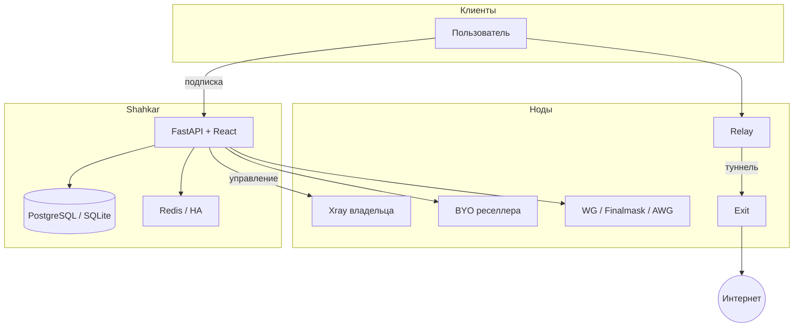

<div align="center">


# Shahkar

**Профессиональная платформа управления прокси — мультинод, мультипротоколы, white-label, готова к продаже**

[](VERSION)
[](LICENSE)
[](https://www.python.org/)
[](https://fastapi.tiangolo.com/)
[](https://github.com/XTLS/Xray-core)
[](docker-compose.yml)

[English](./README.md) · [فارسی](./README-fa.md) · [简体中文](./README-zh-cn.md) · **Русский**

[Установка](#-установка-одной-командой-vps) · [Архитектура](#-архитектура) · [Возможности](#-матрица-возможностей) · [Протоколы](#-протоколы-и-подписки) · [Безопасность](#-безопасность-папка-tests-на-github) · [Репозиторий](https://github.com/KhaJehAmiri/Shahkarpanel)

</div>

---

## Что такое Shahkar?

Полноценная **control plane** для Xray, WireGuard и sing-box: пользователи, ноды, подписки, **реселлеры, биллинг, HA, автоматизация и аналитика** — с современным React-дашбордом (EN / FA / RU / ZH).

| Аудитория | Ценность |
|-----------|----------|
| Провайдер | Мультинод, метрики, failover, туннели для сложных сетей |
| Реселлер | White-label, кошелёк, свои ноды со скидкой |
| Инженеры | API v2, Client API, rules, workflows, плагины |

> Продвинутые функции **выключены по умолчанию** — включайте в **System → Feature flags**.  
> По умолчанию включены: `tunneling`, `smart_routing`, `setup_wizard`.

---

## Установка одной командой (VPS)

На чистом **Ubuntu / Debian** от **root**:

```bash
bash <(curl -fsSL https://raw.githubusercontent.com/KhaJehAmiri/Shahkarpanel/master/scripts/shahkar.sh) install
```

| Элемент | Значение |
|---------|----------|
| Панель | `http://SERVER_IP:8000/dashboard/` |
| Feature flags | `http://SERVER_IP:8000/dashboard/#/system` |
| Управление | `shahkar status` · `logs` · `update` · `backup` · `https` |

Скрипт ставит Docker, клонирует репозиторий в `/opt/shahkar`, поднимает Compose (PostgreSQL по умолчанию), собирает образ `shahkar/node` и печатает логин админа.

---

## Архитектура



---

## Матрица возможностей

| Слой | Содержание | Статус |
|------|------------|--------|
| **Ядро** | Пользователи, inbound’ы, hosts, ноды, мультиформат подписки, Telegram | Стабильно |
| **Протоколы** | VLESS/VMess/Trojan/SS (+SS-2022), Finalmask, AmneziaWG, Hysteria2, TUIC, AnyTLS | Стабильно |
| **Инфраструктура** | PostgreSQL, event bus, бэкапы, feature flags | Стабильно |
| **Операции** | Prometheus, Grafana, rules, plugins, auto-heal | По флагу |
| **Кластер** | SSH bootstrap нод, failover, OTEL, HA leader | По флагу |
| **Коммерция** | RBAC, планы, кошелёк, Stripe, API v2 | По флагу |
| **Масштаб** | Smart routing, Finalmask sharding + hot-replace | Стабильно |
| **White-label** | Tenant’ы, брендинг, BYO-ноды, туннели | По флагу |
| **Client API** | SigmaGuard `/api/v2/client/*` | По флагу |

---

## Протоколы и подписки

| Стек | Возможности |
|------|-------------|
| **Xray** | VLESS, VMess, Trojan, Shadowsocks / SS-2022 · TCP / WS / gRPC / xHTTP · TLS и Reality |
| **Finalmask** | Userspace WireGuard в Xray + DPI-noise (только Xray-клиенты) |
| **Kernel WG** | Обычный WireGuard + опциональный AmneziaWG |
| **sing-box** | Hysteria2, TUIC, AnyTLS (sidecar; Let’s Encrypt) |
| **WARP** | Выход Cloudflare WARP на ноде + TPROXY для kernel WG |

Форматы подписки: v2ray (base64), v2ray-json, sing-box, clash / clash-meta, surge, loon, quantumult, outline, WireGuard, URI Hysteria2 / TUIC / AnyTLS.

Трафик всех продуктовых протоколов учитывается в едином `used_traffic`.

---

## Туннели relay ↔ exit

Когда прямой доступ клиента к зарубежному серверу нестабилен:

```text
Клиент → relay → туннель Reality / WS / gRPC → exit → Интернет
```

- Любой конец — зарегистрированная нода **или** локальный Xray панели
- Шаблоны Reality, WS+TLS, multi-hop
- Kernel WireGuard может идти внутри Reality-hop
- Finalmask на relay идёт в тот же tunnel outbound, что и остальные inbound’ы Xray

---

## Масштаб Finalmask

Для **тысяч peer’ов** без полного рестарта ядра relay (который рвёт Reality и остальные протоколы):

| Механизм | Детали |
|----------|--------|
| **Шардинг** | ~250 peer’ов на inbound; sticky-слот; порты `base + slot` |
| **Hot-replace** | Меняется только затронутый шард (`RemoveInbound` + `AddInbound`) |
| **Запас** | До 64 портов шардов (~16k peer’ов на ноду) |
| **Лаг** | MTU до **1200** на пути tunnel+WARP; `workers=4` |
| **Fallback** | Полный `restart_node` только при смене структуры или сбое hot-replace |

---

## White-label и реселлеры

Одна установка → **несколько реселлеров** со своим брендом:

| Функция | Описание |
|---------|----------|
| Аккаунты реселлеров | Свои пользователи, ноды, кошелёк |
| Суб-реселлеры | Квоты + **комиссия %** |
| Tenant (опционально) | Жёсткая изоляция |
| Брендинг | Лого, цвета, домен, support URL |
| SSH-добавление нод | IP + пароль → установка агента |
| Скидка BYO | Дешевле на своих нодах |
| Планы и биллинг | Кошелёк, GB billing, Stripe |
| Портал пользователя | `/portal/` |

Коммерческие настройки — в UI (**System → Commercial**). Webhook Stripe: `https://YOUR_PANEL/api/billing/webhook/stripe`.

Флаги: `billing`, `user_portal`, `white_label`, `node_provisioning`.

---

## Операции

| Возможность | Примечание |
|-------------|------------|
| Feature flags | 20+ переключателей |
| Provisioning | SSH-установка Docker-агента |
| HA | Redis leader election |
| Метрики | Prometheus `/api/metrics` + опциональный Grafana |
| Auto-heal | Рестарт проблемных нод |
| Бэкапы / обновления | CLI и дашборд |
| HTTPS | `shahkar https` (nginx + Let’s Encrypt) |
| Миграция | Импорт 3x-ui |

---

## Требования

| Среда | Нужно |
|-------|--------|
| **VPS** | Linux, root, порт 8000, рекомендуется 2GB+ RAM |
| **Dev** | Python 3.10+, Xray |
| **Prod** | PostgreSQL 14+, Redis 7+ (для HA) |

---

## Разработка

```bash
git clone https://github.com/KhaJehAmiri/Shahkarpanel.git
cd shahkar
python3 -m venv .venv && source .venv/bin/activate
pip install -r requirements.txt
cp .env.example .env
alembic upgrade head
python3 main.py
```

Данные продакшена: `/var/lib/shahkar` · Compose: `docker-compose.postgres.yml`

---

## Безопасность: папка `tests/` на GitHub

В **публичном** репозитории полной pytest-сюиты **нет** (как у Marzban/3x-ui) — она остаётся локально / в приватном CI. В GitHub Actions: lint + Alembic на PostgreSQL.

Секреты, `.env`, дампы БД и приватные ключи **никогда** не коммитить.

Подробнее: [SECURITY.md](SECURITY.md)

---

## Лицензия

**[AGPL-3.0](LICENSE)** · [Репозиторий](https://github.com/KhaJehAmiri/Shahkarpanel) · [CONTRIBUTING.md](CONTRIBUTING.md)
