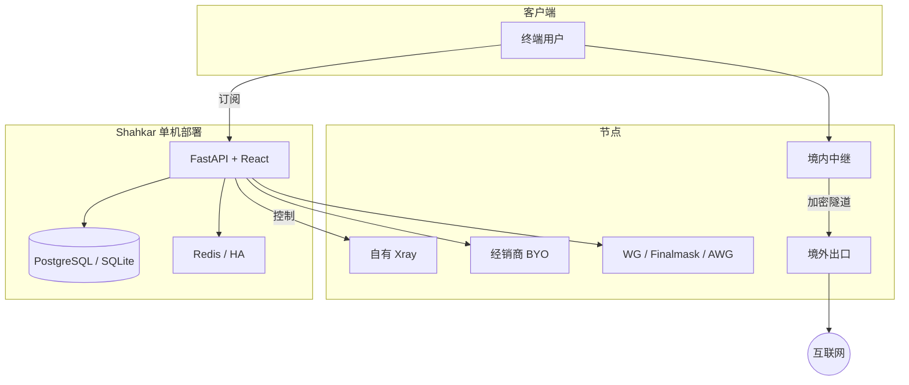

<div align="center">


# Shahkar

**专业代理控制面板 — 多节点、多协议、白标、可商用**

[](VERSION)
[](LICENSE)
[](https://www.python.org/)
[](https://fastapi.tiangolo.com/)
[](https://github.com/XTLS/Xray-core)
[](docker-compose.yml)

[English](./README.md) · [فارسی](./README-fa.md) · **简体中文** · [Русский](./README-ru.md)

[一键安装](#-一键安装-vps) · [架构](#-架构) · [功能](#-功能矩阵) · [协议](#-协议与订阅) · [安全](#-安全公开仓库中的-tests) · [仓库](https://github.com/KhaJehAmiri/Shahkarpanel)

</div>

---

## Shahkar 是什么？

面向 **Xray、WireGuard、sing-box** 的完整控制平面：用户、节点、订阅，以及**经销商、计费、高可用、自动化与流量智能**——配套现代 React 管理后台（中 / 英 / 法波 / 俄）。

| 角色 | 价值 |
|------|------|
| 服务商 | 多节点运维、指标、故障切换、抗封锁隧道 |
| 经销商 | 白标品牌、钱包、自带节点折扣 |
| 工程团队 | API v2、Client API、规则引擎、工作流、插件 |

> 高级功能默认**关闭**——在 **System → Feature flags** 开启。  
> 默认开启：`tunneling`、`smart_routing`、`setup_wizard`。

---

## 一键安装 (VPS)

在全新 **Ubuntu / Debian** 上以 **root** 执行：

```bash
bash <(curl -fsSL https://raw.githubusercontent.com/KhaJehAmiri/Shahkarpanel/master/scripts/shahkar.sh) install
```

| 项目 | 值 |
|------|-----|
| 面板 | `http://SERVER_IP:8000/dashboard/` |
| 功能开关 | `http://SERVER_IP:8000/dashboard/#/system` |
| 管理 | `shahkar status` · `logs` · `update` · `backup` · `https` |

安装脚本会安装 Docker、克隆到 `/opt/shahkar`、默认以 PostgreSQL Compose 启动、构建 `shahkar/node` 镜像并打印管理员凭证。

---

## 架构



---

## 功能矩阵

| 层级 | 要点 | 状态 |
|------|------|------|
| **核心** | 用户、入站、Hosts、节点、多格式订阅、Telegram | 稳定 |
| **协议** | VLESS/VMess/Trojan/SS(+SS-2022)、Finalmask、AmneziaWG、Hysteria2、TUIC、AnyTLS | 稳定 |
| **基础设施** | PostgreSQL、事件总线、备份、特性开关 | 稳定 |
| **运维** | Prometheus、Grafana、规则、插件、自愈 | 需开关 |
| **集群** | SSH 节点引导、故障切换、OTEL、HA Leader | 需开关 |
| **商业** | RBAC、套餐、钱包、Stripe、API v2 | 需开关 |
| **扩展** | 智能路由、Finalmask 分片 + 热替换 | 稳定 |
| **白标** | 租户、品牌、BYO 节点、隧道 | 需开关 |
| **Client API** | SigmaGuard `/api/v2/client/*` | 需开关 |

---

## 协议与订阅

| 栈 | 能力 |
|----|------|
| **Xray** | VLESS、VMess、Trojan、Shadowsocks / SS-2022 · TCP / WS / gRPC / xHTTP · TLS 与 Reality |
| **Finalmask** | Xray 用户态 WireGuard + DPI 噪声（仅 Xray 系客户端） |
| **内核 WG** | 标准 WireGuard + 可选 AmneziaWG |
| **sing-box** | Hysteria2、TUIC、AnyTLS（节点侧车；支持 Let's Encrypt） |
| **WARP** | 节点 Cloudflare WARP 出口 + 内核 WG 的 TPROXY |

订阅格式：v2ray（base64）、v2ray-json、sing-box、clash / clash-meta、surge、loon、quantumult、outline、WireGuard、Hysteria2 / TUIC / AnyTLS URI。

所有产品协议流量汇总到统一的 `used_traffic`。

---

## 中继 ↔ 出口隧道

当客户端直连境外不稳定时：

```text
客户端 → 境内中继 → Reality / WS / gRPC 隧道 → 境外出口 → 互联网
```

- 任一端可为已注册节点，或面板本机 Xray
- 模板：Reality、WS+TLS、多跳
- 内核 WireGuard 可承载于 Reality 跳内
- 中继上的 Finalmask 走与其他 Xray 入站相同的隧道出站（非本地 DIRECT）

---

## Finalmask 大规模扩展

面向**数千 peer**，避免整核重启（否则 Reality 与其它协议全部掉线）：

| 机制 | 说明 |
|------|------|
| **分片** | 每入站约 250 peer；粘性槽位；端口 `base + slot` |
| **热替换** | 仅替换变更分片（`RemoveInbound` + `AddInbound`） |
| **余量** | 预留最多 64 个分片端口（约 1.6 万 peer/节点） |
| **时延优化** | 隧道+WARP 路径 MTU 上限 **1200**；`workers=4` |
| **回退** | 仅在结构变更或热替换失败时完整 `restart_node` |

---

## 白标与经销商

单面板 → **多个经销商**、各自品牌：

| 功能 | 说明 |
|------|------|
| 经销商账号 | 隔离用户、节点、钱包 |
| 子经销商 | 配额 + **佣金比例** |
| 租户（可选） | 更强隔离 |
| 品牌 | Logo、配色、域名、支持链接 |
| SSH 加节点 | IP + 密码 → 安装 agent |
| BYO 折扣 | 自有节点更便宜 |
| 套餐与计费 | 钱包、GB 计费、Stripe |
| 用户门户 | `/portal/` |

商业配置在 UI（**System → Commercial**）。Stripe Webhook：`https://YOUR_PANEL/api/billing/webhook/stripe`。

开关：`billing`、`user_portal`、`white_label`、`node_provisioning`。

---

## 运维与可观测性

| 能力 | 说明 |
|------|------|
| Feature flags | 20+ 开关 |
| 节点开通 | SSH 安装 Docker agent |
| HA | Redis Leader 选举 |
| 指标 | Prometheus `/api/metrics` + 可选 Grafana |
| 自愈 | 重启异常节点 |
| 备份 / 更新 | CLI 与面板内 |
| HTTPS | `shahkar https`（nginx + Let's Encrypt） |
| 迁移 | 3x-ui 导入 |

---

## 环境要求

| 环境 | 需求 |
|------|------|
| **VPS** | Linux、root、开放 8000，建议 2GB+ 内存 |
| **开发** | Python 3.10+、Xray |
| **生产** | PostgreSQL 14+、Redis 7+（HA） |

---

## 开发

```bash
git clone https://github.com/KhaJehAmiri/Shahkarpanel.git
cd shahkar
python3 -m venv .venv && source .venv/bin/activate
pip install -r requirements.txt
cp .env.example .env
alembic upgrade head
python3 main.py
```

生产数据目录：`/var/lib/shahkar` · Compose：`docker-compose.postgres.yml`

---

## 安全：公开仓库中的 `tests/`

公开安装仓库**不包含**完整 pytest / e2e（本地或私有 CI 保留）。GitHub Actions 仅跑 lint + PostgreSQL 上的 Alembic。

切勿提交真实 `.env`、数据库转储、私钥。

详见：[SECURITY.md](SECURITY.md)

---

## 许可证

**[AGPL-3.0](LICENSE)** · [仓库](https://github.com/KhaJehAmiri/Shahkarpanel) · [CONTRIBUTING.md](CONTRIBUTING.md)
