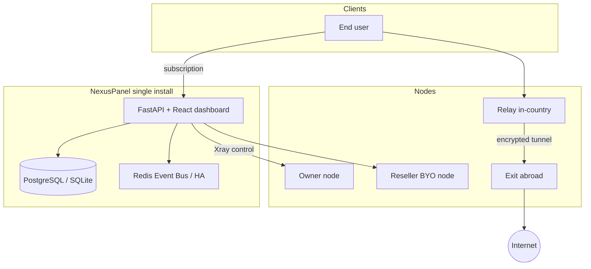

<div align="center">


# NexusPanel

**Professional proxy control plane — multi-node, white-label, commercial-ready**

[](LICENSE)
[](https://www.python.org/)
[](https://fastapi.tiangolo.com/)
[](https://github.com/XTLS/Xray-core)
[](tests/)
[](docker-compose.yml)

**English** · [فارسی](./README-fa.md) · [简体中文](./README-zh-cn.md) · [Русский](./README-ru.md)

[Quick install](#-one-line-install-vps) · [Architecture](#-architecture) · [Features](#-feature-matrix) · [Security & tests](#-security-is-the-tests-folder-on-github) · [**Central handoff (docs/CENTRAL-HANDOFF.md)**](docs/CENTRAL-HANDOFF.md) · [Repository](https://github.com/KhaJehAmiri/nexuspanel)

</div>

---

## Table of contents

- [What is NexusPanel?](#what-is-nexuspanel)
- [One-line install (VPS)](#-one-line-install-vps)
- [Architecture](#-architecture)
- [Feature matrix](#-feature-matrix)
- [White-label & resellers](#-white-label--resellers)
- [Iran ↔ foreign tunnels](#-iran--foreign-tunnels)
- [Requirements](#-requirements)
- [Development](#-development)
- [Production Docker](#-production-docker)
- [Configuration](#-configuration)
- [Central handoff (AI / audit)](#-central-handoff)
- [Security: is `tests/` on GitHub safe?](#-security-is-the-tests-folder-on-github)
- [License](#-license)

---

## What is NexusPanel?

A full-stack **Xray control plane**: users, nodes, subscriptions, **resellers, billing, HA, automation, and traffic intelligence** — with a modern React dashboard.

| Audience | Value |
|----------|--------|
| Service provider | Multi-node ops, metrics, failover |
| Reseller | White-label brand, wallet, BYO nodes at discount |
| Engineering | API v2, rules, workflows, plugins |

> Advanced features are **off by default** — enable via **System → Feature flags** (`/dashboard/#/system`) or the setup API.

---

## One-line install (VPS)

On a fresh **Ubuntu / Debian** server as **root**:

```bash
bash <(curl -fsSL https://raw.githubusercontent.com/KhaJehAmiri/nexuspanel/master/scripts/nexuspanel.sh) install
```

<details>
<summary><strong>What the installer does</strong></summary>

| Step | Action |
|------|--------|
| 1 | Install Docker & git |
| 2 | Clone `KhaJehAmiri/nexuspanel` → `/opt/nexuspanel` |
| 3 | Generate `.env` (admin password, JWT, bootstrap token) |
| 4 | Build & run panel via Docker Compose |
| 5 | Build `nexuspanel/node` image for SSH provisioning |
| 6 | Print dashboard URL and credentials |

</details>

| Item | Value |
|------|--------|
| Dashboard | `http://SERVER_IP:8000/dashboard/` |
| System / Feature flags | `http://SERVER_IP:8000/dashboard/#/system` |
| Manage | `nexuspanel status` · `logs` · `update` · `backup` |

---

## Architecture



---

## Feature matrix

| Layer | Highlights | Phase |
|-------|------------|-------|
| **Core** | Users, inbounds, hosts, nodes, subs, Telegram | Stable |
| **Foundation** | PostgreSQL, event bus, backups, flags, JSON logs | 0 |
| **Operations** | Prometheus, Grafana, rules, plugins, webhooks | 1 |
| **Cluster** | Auto-heal, node bootstrap, failover, OTEL | 2 |
| **Commercial** | RBAC, plans, wallet, invoices, API v2 | 3 |
| **Scale** | HA leader, smart routing, workflows | 4 |
| **Intelligence** | Anomaly detection, exhaustion forecast, marketplace | 5 |
| **White-label** | Tenants, branding, SSH nodes, tunnels, installer | 6 |

---

## White-label & resellers

One panel install → **multiple resellers**, each with their own brand — **no mandatory second server**:

| Feature | Description |
|---------|-------------|
| **Reseller accounts** | Username/password login; scoped users, nodes, wallet |
| **Sub-resellers** | Parent creates child accounts with quotas + **commission %** |
| **Tenant** (optional) | Advanced white-label isolation for plans/nodes |
| **Branding** | Logo, colors, panel title, support URL, custom domain |
| **SSH node add** | Reseller provides IP + password; panel installs agent |
| **BYO discount** | Cheaper usage rate on reseller-owned nodes |
| **Plans & billing** | Reseller-owned plans, wallet top-up, GB usage billing |
| **Payment gateways** | Demo + **Stripe Checkout** (keys & webhook from UI) |
| **User portal** | End-user self-service at `/portal/` (renewal, direct pay) |
| **Owner dashboard** | MRR rollup, wallet float, top resellers on Overview |
| **Onboarding** | First-run wizard for new resellers (branding → plan → user) |

### Commercial settings (UI-managed)

Platform owner configures billing and payments from the dashboard — **no `.env` edits required**:

| Location | What you control |
|----------|------------------|
| **System → Commercial** | GB usage rate, low-wallet threshold, job interval |
| **Billing → Settings** | Same commercial form (sudo shortcut) |
| **Commercial → Payment** | Demo gateway, min/max amounts, Stripe keys & webhook |
| **Commercial → Reseller** | Max sub-resellers per parent, default commission % |

Stripe webhook URL: `https://YOUR_PANEL/api/billing/webhook/stripe`

Enable feature flags: `billing`, `user_portal`, `white_label`, `node_provisioning` (and `tenants` for advanced isolation).

`.env` variables such as `USAGE_BILLING_RATE_PER_GB` remain as **fallbacks** until overridden in the UI.

---

## Iran ↔ foreign tunnels

When direct client → foreign server is unstable:

```text
Client → relay node (in-country) → Reality/WS/gRPC tunnel → exit node (abroad) → Internet
```

Define tunnels in the panel; Xray fragments are generated for relay and exit.

---

## Requirements

| Environment | Needs |
|-------------|--------|
| **VPS install** | Linux, root, port 8000 open, 2GB+ RAM recommended |
| **Development** | Python 3.10+, Xray (or test stub) |
| **Production** | PostgreSQL 14+, Redis 7+ (for HA) |

---

## Development

```bash
git clone https://github.com/KhaJehAmiri/nexuspanel.git
cd nexuspanel
python3 -m venv .venv && source .venv/bin/activate
pip install -r requirements.txt
cp .env.example .env
alembic upgrade head
python3 main.py
```

```bash
python3 nexuspanel-cli.py admin create --sudo
python3 -m pytest -q
```

---

## Production Docker

```bash
docker compose -f docker-compose.postgres.yml up -d --build
docker compose -f docker-compose.monitoring.yml up -d
```

Data: `/var/lib/nexuspanel`

---

## Configuration

| Variable | Purpose |
|----------|---------|
| `SQLALCHEMY_DATABASE_URL` | SQLite (dev) / PostgreSQL (prod) |
| `REDIS_URL` | Event bus + HA |
| `NODE_BOOTSTRAP_TOKEN` | Node self-registration |
| `NODE_AGENT_IMAGE` | Node image (`nexuspanel/node:latest`) |
| `PANEL_PUBLIC_ADDRESS` | Public URL for provisioned nodes |
| `HA_ENABLED` | Multi-instance panel |
| `USAGE_BILLING_RATE_PER_GB` | Fallback GB rate (overridden by **System → Commercial**) |
| `PAYMENT_DEMO_ENABLED` | Fallback for demo gateway toggle |
| `SUB_RESELLER_MAX_PER_PARENT` | Fallback max sub-resellers per parent |

Commercial keys (Stripe, rates, commission) are stored in `platform_settings` and edited from the dashboard.

See [`.env.example`](.env.example).

---

## Central handoff

For AI-assisted audits, security reviews, app design, or resuming work in a new chat:

**Dual product model:** one backend, two faces — (1) **public NexusPanel** via `/sub/` for standard apps (v2rayNG, WireGuard, …), (2) **SigmaGuard** via `/api/v2/client/*` (our proprietary Flutter+Rust app). See [`docs/PUBLIC_DEPLOYMENT.md`](docs/PUBLIC_DEPLOYMENT.md) and [`/opt/sigmaguard/SIGMAGUARD_APP_BRIEF.md`](../sigmaguard/SIGMAGUARD_APP_BRIEF.md).

| Resource | Path |
|----------|------|
| **Unified README** | [`docs/CENTRAL-HANDOFF.md`](docs/CENTRAL-HANDOFF.md) |
| **Visual map (Cursor Canvas)** | `nexuspanel-central.canvas.tsx` |
| Layer 1 (operators) | [`docs/PUBLIC_DEPLOYMENT.md`](docs/PUBLIC_DEPLOYMENT.md) |
| Layer 2 (SigmaGuard API) | [`docs/CLIENT_API.md`](docs/CLIENT_API.md) |
| Layer 2 (app design) | `/opt/sigmaguard/SIGMAGUARD_APP_BRIEF.md` |
| Phase history | [`docs/PROJECT_STATUS.md`](docs/PROJECT_STATUS.md) |
| Security closure log | [`docs/AUDIT-CLOSURE.md`](docs/AUDIT-CLOSURE.md) |

Older canvases (`master-status`, `full-audit`, etc.) redirect to **central**.

---

## Security: is the `tests/` folder on GitHub?

### Should `tests/` be in the repo?

**Yes — it is recommended and not a security risk.**

| Question | Answer |
|----------|--------|
| Passwords or `.env` in tests? | **No** — temp SQLite + fake xray stub only |
| Does production install run tests? | **No** — developers & CI only |
| Safer to delete tests? | **No** — you lose regression coverage |

`tests/conftest.py` uses a temporary database under `/tmp` and never touches production data.

Details: [SECURITY.md](SECURITY.md) · [tests/README.md](tests/README.md)

**Never commit:** real `.env`, DB dumps, private TLS keys (all in `.gitignore`).

---

## License

Licensed under **[AGPL-3.0](LICENSE)**. Network use (SaaS) must comply with AGPL obligations to end users.

---

## Contributing

See [CONTRIBUTING.md](CONTRIBUTING.md) — [github.com/KhaJehAmiri/nexuspanel](https://github.com/KhaJehAmiri/nexuspanel)
