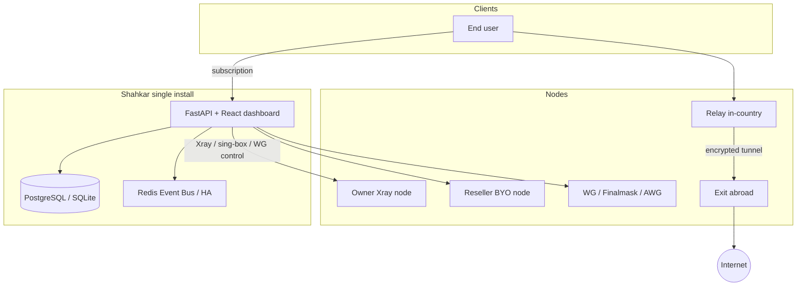

<div align="center">


# Shahkar

**Professional proxy control plane — multi-node, multi-protocol, white-label, commercial-ready**

[](VERSION)
[](LICENSE)
[](https://www.python.org/)
[](https://fastapi.tiangolo.com/)
[](https://github.com/XTLS/Xray-core)
[](docker-compose.yml)

**English** · [فارسی](./README-fa.md) · [简体中文](./README-zh-cn.md) · [Русский](./README-ru.md)

[Quick install](#-one-line-install-vps) · [Architecture](#-architecture) · [Features](#-feature-matrix) · [Protocols](#-protocols--subscriptions) · [Security](#-security-is-the-tests-folder-on-github) · [Repository](https://github.com/KhaJehAmiri/Shahkarpanel)

</div>

---

## Table of contents

- [What is Shahkar?](#what-is-shahkar)
- [One-line install (VPS)](#-one-line-install-vps)
- [Architecture](#-architecture)
- [Feature matrix](#-feature-matrix)
- [Protocols & subscriptions](#-protocols--subscriptions)
- [Iran ↔ foreign tunnels](#-iran--foreign-tunnels)
- [Finalmask scale](#-finalmask-scale-xray-native-wireguard)
- [White-label & resellers](#-white-label--resellers)
- [Ops & observability](#-ops--observability)
- [Requirements](#-requirements)
- [Development](#-development)
- [Production Docker](#-production-docker)
- [Configuration](#-configuration)
- [Docs](#-docs--deployment)
- [Security](#-security-is-the-tests-folder-on-github)
- [License](#-license)

---

## What is Shahkar?

A full-stack **proxy control plane** for Xray, WireGuard, and sing-box: users, nodes, subscriptions, **resellers, billing, HA, automation, and traffic intelligence** — with a modern React dashboard (EN / FA / RU / ZH).

| Audience | Value |
|----------|--------|
| Service provider | Multi-node ops, metrics, failover, Iran-friendly tunnels |
| Reseller | White-label brand, wallet, BYO nodes at discount |
| Engineering | API v2, Client API, rules, workflows, plugins |

> Advanced features are **off by default** — enable via **System → Feature flags** (`/dashboard/#/system`) or the setup API.  
> Exceptions on by default: `tunneling`, `smart_routing`, `setup_wizard`.

---

## One-line install (VPS)

On a fresh **Ubuntu / Debian** server as **root**:

```bash
bash <(curl -fsSL https://raw.githubusercontent.com/KhaJehAmiri/Shahkarpanel/master/scripts/shahkar.sh) install
```

<details>
<summary><strong>What the installer does</strong></summary>

| Step | Action |
|------|--------|
| 1 | Install Docker & git (auto-swap on low-RAM VPS) |
| 2 | Clone `KhaJehAmiri/Shahkarpanel` → `/opt/shahkar` |
| 3 | Generate `.env` (admin password, JWT, bootstrap token) |
| 4 | Build & run panel via Docker Compose (PostgreSQL by default) |
| 5 | Build `shahkar/node` image for SSH provisioning |
| 6 | Print dashboard URL and credentials |

</details>

| Item | Value |
|------|--------|
| Dashboard | `http://SERVER_IP:8000/dashboard/` |
| System / Feature flags | `http://SERVER_IP:8000/dashboard/#/system` |
| Manage | `shahkar status` · `logs` · `update` · `backup` · `https` |

---

## Architecture



---

## Feature matrix

| Layer | Highlights | Status |
|-------|------------|--------|
| **Core** | Users, inbounds, hosts, nodes, multi-format subs, Telegram bot | Stable |
| **Protocols** | VLESS/VMess/Trojan/SS (+ SS-2022), Finalmask WG, AmneziaWG, Hysteria2, TUIC, AnyTLS | Stable |
| **Foundation** | PostgreSQL, event bus, backups, flags, JSON logs | Stable |
| **Operations** | Prometheus, Grafana, rules, plugins, webhooks, auto-heal | Flag-gated |
| **Cluster** | Node SSH bootstrap, failover, OTEL, HA leader (Redis) | Flag-gated |
| **Commercial** | RBAC, plans, wallet, invoices, Stripe, API v2 | Flag-gated |
| **Scale** | Smart routing, workflows, Finalmask peer sharding + hot-replace | Stable / flag |
| **Intelligence** | Anomaly detection, exhaustion forecast, marketplace | Flag-gated |
| **White-label** | Tenants, branding, reseller BYO nodes, tunnels, installer | Flag-gated |
| **Client API** | SigmaGuard negotiate/config (`/api/v2/client/*`) | Flag-gated |

---

## Protocols & subscriptions

| Stack | What you get |
|-------|----------------|
| **Xray** | VLESS, VMess, Trojan, Shadowsocks / SS-2022 · TCP / WS / gRPC / xHTTP · TLS & Reality |
| **Finalmask** | Xray-native userspace WireGuard + DPI noise (Xray clients only) |
| **Kernel WG** | Plain WireGuard + optional AmneziaWG on the same node |
| **sing-box** | Hysteria2, TUIC, AnyTLS (sidecar on the node; LE TLS supported) |
| **WARP** | Per-node Cloudflare WARP exit + TPROXY for kernel WG |

**Subscription formats:** v2ray (base64), v2ray-json, sing-box, clash / clash-meta, surge, loon, quantumult, outline, WireGuard `.conf` / share links, Hysteria2 / TUIC / AnyTLS URIs — unified under one token when enabled.

Traffic from all product protocols rolls into a single central `used_traffic` counter.

---

## Iran ↔ foreign tunnels

When direct client → foreign server is unstable:

```text
Client → relay (in-country) → Reality / WS / gRPC tunnel → exit (abroad) → Internet
```

- Either hop can be a registered node **or** the panel’s local Xray core
- Templates: Reality relay→exit, WS+TLS, multi-hop chains
- Native WireGuard can ride inside the Reality hop (dokodemo UDP capture on the relay)
- Finalmask on a relay routes through the same tunnel outbound as other Xray inbounds (not local DIRECT)

---

## Finalmask scale (Xray-native WireGuard)

Built for **thousands of peers** without restarting the whole relay (which would drop Reality + every other protocol):

| Mechanism | Detail |
|-----------|--------|
| **Sharding** | ~250 peers per inbound; sticky `finalmask_slot`; ports `base + slot` |
| **Hot-replace** | Only the changed shard is swapped (`RemoveInbound` + `AddInbound`) |
| **Headroom** | Up to 64 shard ports reserved (~16k peers/node) |
| **Lag knobs** | MTU capped at **1200** on tunnel+WARP paths; inbound `workers=4` |
| **Fallback** | Full `restart_node` only on structure change (keys / noise / MTU / listen) or hot-replace failure |

---

## White-label & resellers

One panel install → **multiple resellers**, each with their own brand — **no mandatory second server**:

| Feature | Description |
|---------|-------------|
| **Reseller accounts** | Scoped users, nodes, wallet |
| **Sub-resellers** | Quotas + **commission %** |
| **Tenant** (optional) | Advanced white-label isolation |
| **Branding** | Logo, colors, title, support URL, custom domain |
| **SSH node add** | Reseller IP + password → panel installs agent |
| **BYO discount** | Cheaper usage on reseller-owned nodes |
| **Plans & billing** | Reseller plans, wallet top-up, GB usage billing |
| **Payment gateways** | Demo + **Stripe Checkout** (keys from UI) |
| **User portal** | Self-service at `/portal/` |
| **Owner dashboard** | MRR, wallet float, top resellers |

### Commercial settings (UI-managed)

| Location | What you control |
|----------|------------------|
| **System → Commercial** | GB rate, low-wallet threshold, job interval |
| **Commercial → Payment** | Demo gateway, Stripe keys & webhook |
| **Commercial → Reseller** | Max sub-resellers, default commission % |

Stripe webhook: `https://YOUR_PANEL/api/billing/webhook/stripe`

Enable flags: `billing`, `user_portal`, `white_label`, `node_provisioning` (and `tenants` if needed).

---

## Ops & observability

| Capability | Notes |
|------------|--------|
| **Feature flags** | 20+ toggles; global + per-admin override |
| **Node provisioning** | SSH install of Docker agent (Xray or WireGuard core) |
| **HA** | Redis leader election; singleton jobs run on leader only |
| **Metrics** | Prometheus `/api/metrics` + optional Grafana compose stack |
| **Auto-heal** | Restart unhealthy nodes (flag-gated) |
| **Backups** | `shahkar backup` / restore; scheduled jobs |
| **Updates** | In-dashboard / CLI panel update |
| **Migration** | 3x-ui import API |
| **HTTPS** | `shahkar https` — nginx + Let’s Encrypt |

---

## Requirements

| Environment | Needs |
|-------------|--------|
| **VPS install** | Linux, root, port 8000 open, 2GB+ RAM recommended |
| **Development** | Python 3.10+, Xray (or test stub) |
| **Production** | PostgreSQL 14+, Redis 7+ (for HA) |

---

## Development

```bash
git clone https://github.com/KhaJehAmiri/Shahkarpanel.git
cd shahkar
python3 -m venv .venv && source .venv/bin/activate
pip install -r requirements.txt
cp .env.example .env
alembic upgrade head
python3 main.py
```

```bash
python3 shahkar-cli.py admin create --sudo
python3 -m pytest -q   # full suite is local / private CI — see Security
```

---

## Production Docker

```bash
docker compose -f docker-compose.postgres.yml up -d --build
docker compose -f docker-compose.monitoring.yml up -d   # optional Prometheus + Grafana
```

Data: `/var/lib/shahkar`

---

## Configuration

| Variable | Purpose |
|----------|---------|
| `SQLALCHEMY_DATABASE_URL` | SQLite (dev) / PostgreSQL (prod) |
| `REDIS_URL` | Event bus + HA |
| `NODE_BOOTSTRAP_TOKEN` | Node self-registration |
| `NODE_AGENT_IMAGE` | Node image (`shahkar/node:latest`) |
| `PANEL_PUBLIC_ADDRESS` | Public URL for provisioned nodes |
| `HA_ENABLED` | Multi-instance panel |
| `USAGE_BILLING_RATE_PER_GB` | Fallback GB rate (overridden in UI) |

Commercial keys (Stripe, rates, commission) live in `platform_settings` and are edited from the dashboard.

See [`.env.example`](.env.example).

---

## Docs & deployment

| Resource | Path |
|----------|------|
| Public deployment | [`docs/PUBLIC_DEPLOYMENT.md`](docs/PUBLIC_DEPLOYMENT.md) |
| HTTPS setup | [`docs/HTTPS_SETUP.md`](docs/HTTPS_SETUP.md) |
| Client API (SigmaGuard) | [`docs/CLIENT_API.md`](docs/CLIENT_API.md) |
| Developer API (bots / resellers) | [`docs/DEVELOPER_API.md`](docs/DEVELOPER_API.md) |
| Security / secrets layout | [`SECURITY.md`](SECURITY.md) |
| Changelog | [`CHANGELOG.md`](CHANGELOG.md) |

---

## Security: is the `tests/` folder on GitHub?

### Public install repo

The **full pytest suite, e2e scripts, and internal handoff docs stay local** on development servers — they are listed in `.gitignore` and are **not** pushed to this public repository.

| Question | Answer |
|----------|--------|
| Are tests on GitHub? | **No** — run locally or on your private CI clone |
| Passwords or `.env` in the public tree? | **No** |
| What runs in GitHub Actions? | **Lint + Alembic migrations** on PostgreSQL |

Details: [SECURITY.md](SECURITY.md)

**Never commit:** real `.env`, DB dumps, private TLS keys, server IPs/passwords in scripts.

---

## License

Licensed under **[AGPL-3.0](LICENSE)**. Network use (SaaS) must comply with AGPL obligations to end users.

---

## Contributing

See [CONTRIBUTING.md](CONTRIBUTING.md) — [github.com/KhaJehAmiri/Shahkarpanel](https://github.com/KhaJehAmiri/Shahkarpanel)
