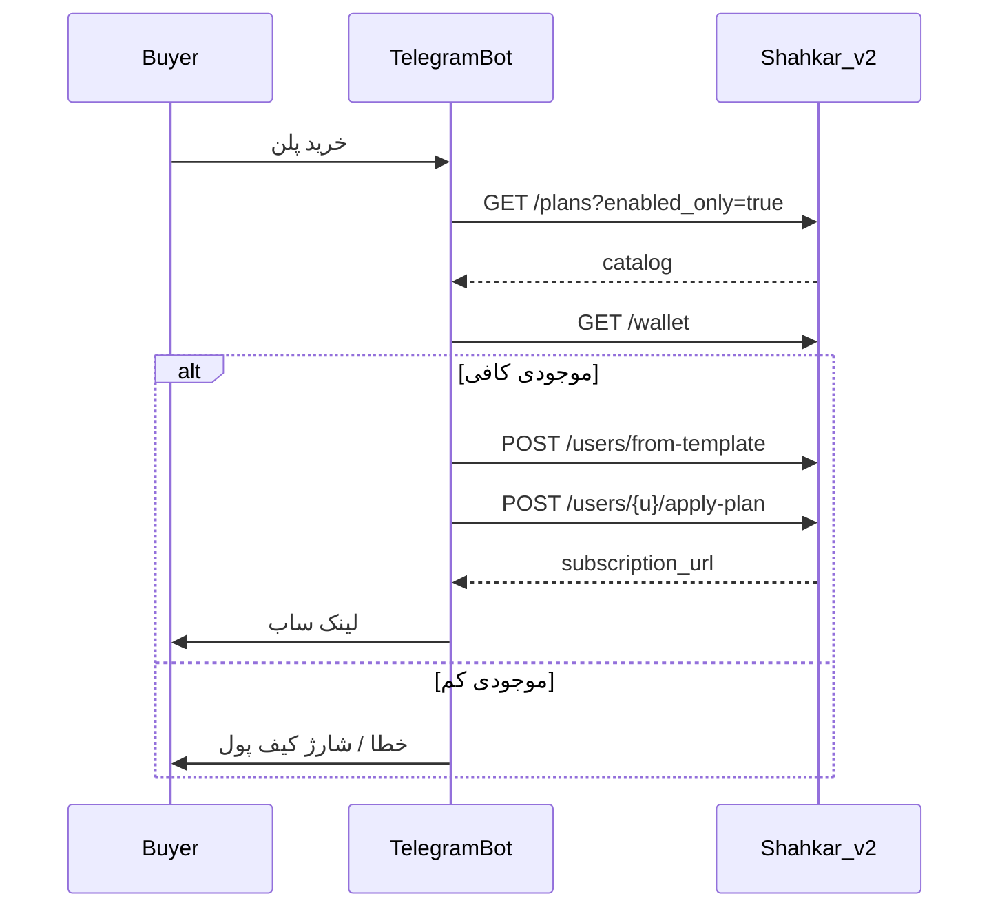

# Developer API — ربات تلگرام و نمایندگی (`/api/v2`)

قرارداد HTTP برای **ربات‌های خارجی** (مثلاً فروش در تلگرام) و **مدیریت نمایندگی** بدون نیاز به JWT داشبورد.
احراز هویت با **API Key**؛ منطق کسب‌وکار همان پنل است (مالکیت کاربر، کیف پول، پلن).

> **فلگ.** همهٔ endpointهای این سند پشت `api_v2` هستند (پیش‌فرض خاموش).
> از **System → Feature flags** یا اسکریپت فعال‌سازی پنل روشن کنید.
>
> **توجه.** مسیر `/api/v2/client/*` مربوط به **SigmaGuard Client API** است
> ([`CLIENT_API.md`](./CLIENT_API.md)) و با این قرارداد متفاوت است.

---

## فعال‌سازی

1. فلگ `api_v2` را روشن کنید.
2. برای فروش پلن / کیف پول، فلگ `billing` هم لازم است.
3. از داشبورد: **System → API keys → Create**  
   یا `POST /api/api-keys` با Bearer JWT ادمین/نماینده.
4. کلید خام (`nxp_…`) **فقط یک‌بار** نمایش داده می‌شود؛ ذخیره کنید.

### ساخت کلید (نماینده یا sudo)

```http
POST /api/api-keys
Authorization: Bearer <admin_jwt>
Content-Type: application/json

{
  "name": "telegram-bot",
  "scopes": ["users:read", "users:write", "templates:read", "plans:read", "billing:read", "reseller:read", "branding:read", "branding:write"]
}
```

```json
{
  "id": 1,
  "name": "telegram-bot",
  "prefix": "a1b2c3d4",
  "scopes": ["users:read", "users:write", "templates:read", "plans:read", "billing:read", "reseller:read", "branding:read", "branding:write"],
  "revoked": false,
  "key": "nxp_a1b2c3d4_…"
}
```

- **نماینده** فقط برای حساب خودش کلید می‌سازد؛ scopes به نقشش محدود می‌شود.
- اگر `scopes` خالی/حذف شود، همهٔ scopes مجاز نقش اعمال می‌شود.
- لیست scopes مجاز نقش فعلی: `GET /api/api-keys/scopes`
- لغو: `DELETE /api/api-keys/{id}`

---

## احراز هویت

همهٔ درخواست‌های `/api/v2/*` (به‌جز Client API):

```http
X-API-Key: nxp_{prefix}_{secret}
```

یا به‌جای آن، Bearer JWT ادمین داشبورد (در این حالت بررسی scope کلید رد می‌شود).

```bash
curl -sS -H "X-API-Key: $NXP_KEY" https://panel.example/api/v2/users
```

---

## Scopes

| Scope | کاربرد |
|-------|--------|
| `users:read` | لیست / جزئیات / usage کاربر |
| `users:write` | ساخت، ویرایش، حذف، ریست، rotate/revoke ساب، apply-plan |
| `templates:read` | لیست قالب‌های کاربر |
| `plans:read` | کاتالوگ پلن نماینده |
| `plans:write` | ساخت / ویرایش / حذف پلن |
| `billing:read` | کیف پول و تراکنش‌ها |
| `billing:write` | رزرو برای عملیات مالی آیندهٔ v2 |
| `reseller:read` | workspace (سهمیه، موجودی، ترافیک) |
| `branding:read` | خواندن برند وایت‌لیبل / وضعیت SSL دامنه |
| `branding:write` | تنظیم برند، دامنه ساب، صدور SSL |
| `*` | همه (فقط sudo) |

`users:*` و مشابه به‌عنوان wildcard منبع هم پذیرفته می‌شود.

**مالکیت:** کلید به `admin_id` وصل است. نماینده فقط کاربران خودش را می‌بیند/تغییر می‌دهد.

---

## کاربران

پایه: `https://{panel}/api/v2`

### `GET /users`

صفحه‌بندی کاربران.

| Query | توضیح | پیش‌فرض |
|-------|--------|---------|
| `page` | صفحه (≥1) | `1` |
| `size` | اندازه (1–200) | `50` |
| `search` | فیلتر نام کاربری (ilike) | — |

```json
{
  "items": [
    {
      "username": "alice",
      "status": "active",
      "used_traffic": 1048576,
      "data_limit": 10737418240,
      "expire": 1735689600,
      "subscription_url": "https://…/sub/…",
      "public_subscription_url": "https://…"
    }
  ],
  "total": 1,
  "page": 1,
  "size": 50
}
```

### `GET /users/{username}`

جزئیات کامل (شامل `links` / `subscription_url` برای ارسال به خریدار).

### `POST /users`

بدنه همان `UserCreate` داشبورد (حداقل `username` و معمولاً `proxies` / `inbounds`).

```json
{
  "username": "buyer01",
  "status": "active",
  "expire": 1735689600,
  "data_limit": 10737418240,
  "proxies": { "vless": {} },
  "inbounds": { "vless": ["VLESS_INBOUND"] }
}
```

`409` اگر کاربر تکراری باشد. پاسخ: `UserResponse` با لینک ساب.

### `POST /users/from-template`

```json
{
  "template_id": 3,
  "username": "buyer02",
  "status": "active"
}
```

`status` اختیاری است؛ در صورت حذف، پیش‌فرض قالب/active استفاده می‌شود.

### `PUT /users/{username}`

بدنه `UserModify` (فیلدهای null/حذف‌شده تغییر نمی‌کنند).

### `DELETE /users/{username}`

```json
{ "detail": "User successfully deleted" }
```

### `POST /users/{username}/reset`

ریست مصرف ترافیک.

### `POST /users/{username}/rotate-sub`

چرخش فقط لینک ساب (`sub_token`)؛ UUID پروکسی ثابت می‌ماند.

### `POST /users/{username}/revoke-sub`

ابطال ساب و اعتبار پروکسی‌ها.

### `POST /users/{username}/apply-plan`

فروش/تمدید با پلن تجاری (نیاز به `billing` و موجودی کیف پول نمایندهٔ مالک کاربر).

```json
{ "plan_id": 12 }
```

| کد | معنی |
|----|------|
| `402` | موجودی کیف پول کافی نیست |
| `404` | پلن یا billing غیرفعال |
| `400` | کاربر بدون مالک نماینده |

### `GET /users/{username}/usage`

| Query | توضیح |
|-------|--------|
| `start` | ISO datetime (اختیاری؛ پیش‌فرض ۳۰ روز قبل) |
| `end` | ISO datetime (اختیاری؛ الان) |

```json
{ "username": "alice", "usages": [ /* … */ ] }
```

---

## قالب‌ها

### `GET /templates`

| Query | توضیح |
|-------|--------|
| `offset` / `limit` | صفحه‌بندی اختیاری |

```json
[
  {
    "id": 3,
    "name": "1month-50gb",
    "data_limit": 53687091200,
    "expire_duration": 2592000,
    "username_prefix": "u_",
    "username_suffix": null
  }
]
```

ساخت/ویرایش قالب همچنان فقط از داشبورد sudo است.

### `GET /templates/{template_id}`

جزئیات کامل قالب (`UserTemplateResponse`).

---

## پلن‌ها (کاتالوگ نمایندگی)

Scoped به tenant / مالک نماینده.

### `GET /plans?enabled_only=false`

### `POST /plans`

```json
{
  "name": "ماهانه ۵۰گیگ",
  "price": 150000,
  "data_limit": 53687091200,
  "duration_days": 30,
  "device_limit": 2,
  "enabled": true
}
```

`409` اگر نام در کاتالوگ شما تکراری باشد.

### `PUT /plans/{plan_id}` / `DELETE /plans/{plan_id}`

---

## کیف پول و workspace

### `GET /wallet` — scope `billing:read`

```json
{ "admin_id": 5, "balance": 500000 }
```

### `GET /transactions` — scope `billing:read`

| Query | پیش‌فرض |
|-------|---------|
| `page` | `1` |
| `size` | `50` |

```json
{
  "items": [
    {
      "id": 99,
      "admin_id": 5,
      "amount": -150000,
      "type": "plan_sale",
      "description": "Plan sale for buyer01 — ماهانه ۵۰گیگ",
      "reference": "user:42:plan:12",
      "created_at": "2026-07-27T00:00:00"
    }
  ],
  "total": 1,
  "page": 1,
  "size": 50
}
```

### `GET /workspace` — scope `reseller:read`

خلاصه سهمیه / کیف پول / ترافیک نماینده:

```json
{
  "username": "reseller1",
  "role": "reseller",
  "tenant_id": 2,
  "tenant_name": "Shop A",
  "users_count": 120,
  "max_users": 500,
  "wallet_balance": 500000,
  "wallet_low": false,
  "wallet_blocked": false,
  "users_usage": 1099511627776,
  "traffic_remaining": null,
  "prepaid_traffic_remaining": 0
}
```

---

## فلو پیشنهادی ربات فروش (تلگرام)



1. `GET /plans?enabled_only=true` — نمایش پلن‌ها به مشتری  
2. `GET /wallet` — اطمینان از موجودی  
3. `POST /users/from-template` **یا** `POST /users` — ساخت اکانت  
4. در صورت نیاز `POST /users/{username}/apply-plan` — اعمال پلن و کسر کیف پول  
5. فیلد `subscription_url` / `public_subscription_url` / `links` را به تلگرام بفرستید  
6. تمدید بعدی: دوباره `apply-plan`

---

## نمونه Python (requests + ربات)

```python
import os
import requests

BASE = os.environ["NXP_BASE"].rstrip("/")  # https://panel.example
KEY = os.environ["NXP_KEY"]
H = {"X-API-Key": KEY, "Content-Type": "application/json"}


def create_and_sell(username: str, template_id: int, plan_id: int) -> str:
    r = requests.post(
        f"{BASE}/api/v2/users/from-template",
        headers=H,
        json={"template_id": template_id, "username": username},
        timeout=60,
    )
    r.raise_for_status()
    user = r.json()

    r2 = requests.post(
        f"{BASE}/api/v2/users/{user['username']}/apply-plan",
        headers=H,
        json={"plan_id": plan_id},
        timeout=60,
    )
    if r2.status_code == 402:
        raise RuntimeError("موجودی کیف پول کافی نیست")
    r2.raise_for_status()
    renewed = r2.json()
    return renewed.get("subscription_url") or renewed.get("public_subscription_url") or ""


# مثال handler (aiogram / pyTelegramBotAPI):
# url = create_and_sell(f"tg{user_id}", template_id=3, plan_id=12)
# bot.send_message(chat_id, f"اکانت شما:\n{url}")
```

---

## خطاهای رایج

| HTTP | معنی |
|------|------|
| `401` | کلید نامعتبر یا نبود هدر |
| `403` | scope کم یا دسترسی به کاربر دیگران |
| `404` | فلگ `api_v2` خاموش، یا منبع پیدا نشد |
| `402` | موجودی ناکافی در `apply-plan` |
| `409` | کاربر یا نام پلن تکراری |
| `400` | اعتبارسنجی بدنه / ادمین بدون رکورد DB |

---

## مدیریت خارجی کلیدها

| عملیات | مسیر | Auth |
|--------|------|------|
| لیست کلیدهای من | `GET /api/api-keys` | JWT داشبورد |
| scopes مجاز من | `GET /api/api-keys/scopes` | JWT |
| ساخت کلید | `POST /api/api-keys` | JWT (sudo یا نماینده) |
| لغو کلید | `DELETE /api/api-keys/{id}` | JWT (مالک) |

کلید همیشه به همان ادمینی که ساخته متصل است؛ عمل‌های `/api/v2` با هویت همان ادمین اجرا می‌شوند.

---

## وایت‌لیبل (برند نمایندگی)

نیاز به فلگ‌های `api_v2` **و** `white_label`. نماینده باید به یک tenant وصل باشد.

### `GET /branding` — scope `branding:read`

```json
{
  "panel_title": "فروشگاه من",
  "logo_url": "https://cdn.example/logo.png",
  "favicon_url": null,
  "primary_color": "#0ea5e9",
  "support_url": "https://t.me/myshop",
  "sub_profile_title": "MyShop VPN",
  "domain": "sub.myshop.com",
  "panel_url": "https://sub.myshop.com",
  "sub_path": "sub",
  "sub_port": 2096
}
```

### `PUT /branding` — scope `branding:write`

هر فیلد اختیاری است؛ فقط فیلدهای ارسالی عوض می‌شوند.

```json
{
  "panel_title": "فروشگاه من",
  "logo_url": "https://cdn.example/logo.png",
  "primary_color": "#0ea5e9",
  "support_url": "https://t.me/myshop",
  "sub_profile_title": "MyShop VPN",
  "domain": "sub.myshop.com",
  "sub_path": "sub",
  "sub_port": 2096
}
```

`domain` باید hostname باشد (مثل `sub.myshop.com`). بعد از ست کردن دامنه، DNS را به IP پنل بزنید.

### `GET /branding/subscription-ports` — `branding:read`

پورت‌های اشغال‌شده و پیشنهادهای آزاد برای ساب.

### `GET /branding/subscription-ssl` — `branding:read`

وضعیت DNS و گواهی Let's Encrypt.

### `POST /branding/subscription-ssl` — `branding:write`

صدور / تلاش مجدد گواهی بعد از درست بودن DNS.

### فلو ربات برای برند نماینده

1. نماینده در ربات نام برند، لوگو، رنگ، لینک پشتیبانی را وارد می‌کند  
2. `PUT /api/v2/branding`  
3. در صورت داشتن دامنه: راهنمای DNS → `GET …/subscription-ssl` → `POST …/subscription-ssl`  
4. لینک ساب کاربران بعدی از دامنه/برند همان tenant ساخته می‌شود  

---

## تفاوت با API داشبورد

| | Developer `/api/v2` | داشبورد `/api/*` |
|--|---------------------|------------------|
| Auth | `X-API-Key` (+ JWT اختیاری) | Bearer JWT + RBAC |
| مخاطب | ربات / اتوماسیون خارجی | UI پنل |
| سطح | کاربران، قالب، پلن، کیف پول، workspace | کل پنل (نود، سیستم، …) |
| فلگ | `api_v2` | همیشه |

برای عملیات زیرساختی (نود، اینباند، سیستم) همچنان از JWT داشبورد استفاده کنید.
