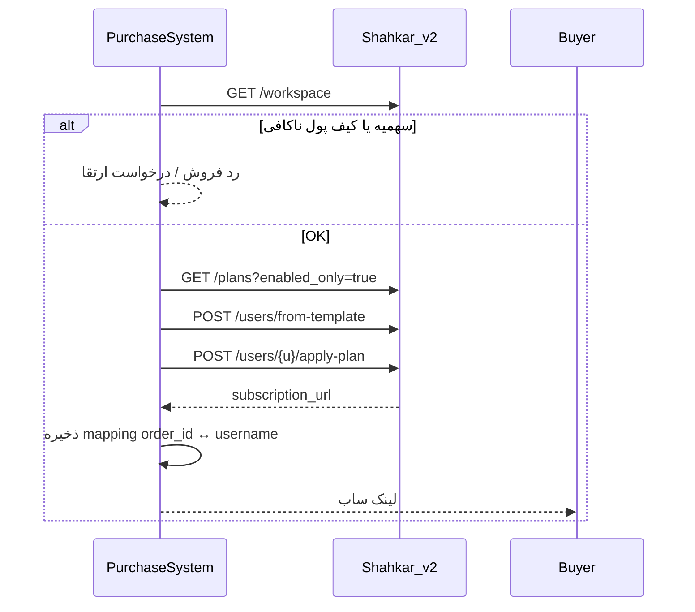

# Shahkar — قرارداد کامل API برای سینک سیستم خرید / نمایندگی

این سند **قرارداد یکپارچه‌سازی** بین سیستم فروش خارجی (ربات، فروشگاه، CRM) و پنل Shahkar است.
برای دولوپر کافی است؛ **نیازی به دسترسی گیت نیست.**

| لایه | پایه URL | احراز هویت | مخاطب |
|------|----------|------------|--------|
| **Developer API** | `/api/v2/*` | `X-API-Key` | ربات / سیستم خرید |
| **Dashboard Admin** | `/api/admin*` ، `/api/billing/*` ، `/api/reseller/*` | Bearer JWT | ساخت نماینده، لیمیت، شارژ کیف پول (sudo) |
| **OpenAPI زنده** | `/docs` ، `/redoc` | — | وقتی فلگ `DOCS` روشن باشد |

> **قانون طلایی سینک:** سیستم خرید منبع حقیقت سفارش/پرداخت است؛ پنل منبع حقیقت **اکانت VPN، لینک ساب، سهمیه نماینده، کیف پول پنل** است. بعد از هر خرید موفق، پنل را از طریق API به‌روز کنید و `subscription_url` را به مشتری بدهید.

---

## ۱) پیش‌نیاز و فعال‌سازی

1. فلگ **`api_v2`** روشن باشد (System → Feature flags).
2. برای فروش پلن / کیف پول: فلگ **`billing`**.
3. برای برند وایت‌لیبل نماینده: فلگ **`white_label`**.
4. ساخت API Key از داشبورد: **System → API keys → Create**  
   یا `POST /api/api-keys` با JWT ادمین.

کلید خام فقط **یک‌بار** برمی‌گردد (`nxp_{prefix}_{secret}`). ذخیره امن کنید.

```http
POST /api/api-keys
Authorization: Bearer <admin_jwt>
Content-Type: application/json

{
  "name": "purchase-system",
  "scopes": [
    "users:read", "users:write",
    "templates:read",
    "plans:read", "plans:write",
    "billing:read", "billing:write",
    "reseller:read",
    "branding:read", "branding:write"
  ]
}
```

پاسخ نمونه:

```json
{
  "id": 1,
  "name": "purchase-system",
  "prefix": "a1b2c3d4",
  "scopes": ["users:read", "users:write", "…"],
  "revoked": false,
  "key": "nxp_a1b2c3d4_…"
}
```

| عملیات کلید | مسیر | Auth |
|-------------|------|------|
| scopes مجاز من | `GET /api/api-keys/scopes` | JWT |
| لیست کلیدها | `GET /api/api-keys` | JWT |
| ساخت | `POST /api/api-keys` | JWT |
| لغو | `DELETE /api/api-keys/{id}` | JWT |

---

## ۲) احراز هویت

### ۲.۱ Developer API (`/api/v2`)

```http
X-API-Key: nxp_{prefix}_{secret}
```

جایگزین: `Authorization: Bearer <admin_jwt>` (در این حالت بررسی scope کلید رد می‌شود).

```bash
export NXP_BASE="https://panel.example"
export NXP_KEY="nxp_…"

curl -sS -H "X-API-Key: $NXP_KEY" "$NXP_BASE/api/v2/workspace"
```

### ۲.۲ داشبورد / مدیریت نمایندگی (JWT)

```http
POST /api/admin/token
Content-Type: application/x-www-form-urlencoded

username=master&password=••••
```

پاسخ: `{ "access_token": "…", "token_type": "bearer", "refresh_token": "…", "expires_in": … }`

سپس:

```http
Authorization: Bearer <access_token>
```

تازه‌سازی: `POST /api/admin/refresh` با `{ "refresh_token": "…" }`.

### ۲.۳ Scopes کلید v2

| Scope | کاربرد |
|-------|--------|
| `users:read` | لیست / جزئیات / usage کاربر |
| `users:write` | ساخت، ویرایش، حذف، ریست، rotate/revoke ساب، apply-plan |
| `templates:read` | لیست قالب‌ها |
| `plans:read` | کاتالوگ پلن |
| `plans:write` | ساخت / ویرایش / حذف پلن |
| `billing:read` | کیف پول و تراکنش‌ها |
| `billing:write` | رزرو عملیات مالی آیندهٔ v2 |
| `reseller:read` | workspace (سهمیه، موجودی، ترافیک) |
| `branding:read` / `branding:write` | برند وایت‌لیبل |
| `*` | همه (فقط sudo) |

**مالکیت:** کلید به `admin_id` وصل است. نماینده فقط کاربران/پلن‌های خودش را می‌بیند.

---

## ۳) واحدها و قوانین عمومی

| مفهوم | واحد / قانون |
|--------|----------------|
| ترافیک (`data_limit`, `used_traffic`, `max_total_traffic`) | **بایت** (مثلاً ۱۰ گیگ = `10737418240`) |
| انقضا کاربر (`expire`) | **Unix timestamp (ثانیه)**؛ `null` / `0` یعنی بدون انقضا |
| مدت قالب (`expire_duration`) | **ثانیه** |
| مدت پلن (`duration_days`) | روز |
| قیمت / کیف پول | عدد صحیح واحد پول پنل (معمولاً ریال) |
| نام کاربری کاربر | `^[a-zA-Z0-9_]{3,32}$` |
| وضعیت ساخت کاربر | فقط `active` یا `on_hold` |
| وضعیت ویرایش | `active` / `disabled` / `on_hold` / `limited` / `expired` |

اگر فلگ مربوطه خاموش باشد، endpointها معمولاً **`404`** می‌دهند (نه 403).

---

# بخش A — Developer API کامل (`/api/v2`)

پایه: `https://{panel}/api/v2`

---

## A.1 کاربران

### `GET /users` — `users:read`

| Query | پیش‌فرض | توضیح |
|-------|---------|--------|
| `page` | `1` | ≥ 1 |
| `size` | `50` | 1–200 |
| `search` | — | فیلتر ilike روی username |

```json
{
  "items": [
    {
      "username": "alice",
      "status": "active",
      "used_traffic": 1048576,
      "data_limit": 10737418240,
      "expire": 1735689600,
      "subscription_url": "https://…/sub/…",
      "public_subscription_url": "https://…"
    }
  ],
  "total": 1,
  "page": 1,
  "size": 50
}
```

### `GET /users/{username}` — `users:read`

جزئیات کامل `UserResponse` شامل `links`، `subscription_url`، `public_subscription_url`، `proxies`، `admin`، مصرف و …

### `POST /users` — `users:write`

بدنهٔ `UserCreate`. حداقل: `username` + حداقل یک پروتکل در `proxies` (+ معمولاً `inbounds`).

```json
{
  "username": "buyer01",
  "status": "active",
  "expire": 1735689600,
  "data_limit": 10737418240,
  "device_limit": 2,
  "data_limit_reset_strategy": "no_reset",
  "note": "order #12345",
  "proxies": { "vless": {} },
  "inbounds": { "vless": ["VLESS_INBOUND"] },
  "portal_enabled": false
}
```

| کد | معنی |
|----|------|
| `200`/`201` | ساخته شد؛ لینک ساب در پاسخ |
| `409` | نام کاربری تکراری |
| `400` | اعتبارسنجی / سهمیه نماینده پر شده |

### `POST /users/from-template` — `users:write` *(پیشنهادی برای فروش)*

```json
{
  "template_id": 3,
  "username": "buyer02",
  "status": "active"
}
```

`status` اختیاری است.

### `PUT /users/{username}` — `users:write`

بدنهٔ `UserModify` — فقط فیلدهای ارسالی عوض می‌شوند. می‌توانید با این endpoint لیمیت ترافیک، انقضا، وضعیت، `device_limit` و … را سینک کنید.

```json
{
  "status": "active",
  "expire": 1738368000,
  "data_limit": 21474836480,
  "device_limit": 3,
  "note": "renewed order #12346"
}
```

### `DELETE /users/{username}` — `users:write`

```json
{ "detail": "User successfully deleted" }
```

حذف دائمی از پنل + حذف از دیتاپلین (نودها). برای «قطع سرویس بدون حذف» از `PUT` با `"status": "disabled"` استفاده کنید.

### `POST /users/{username}/reset` — `users:write`

ریست `used_traffic` (مصرف فعلی صفر).

### `POST /users/{username}/rotate-sub` — `users:write`

چرخش فقط لینک ساب (`sub_token`)؛ UUID پروکسی ثابت می‌ماند. لینک قبلی باطل می‌شود.

### `POST /users/{username}/revoke-sub` — `users:write`

ابطال ساب و اعتبار پروکسی‌ها.

### `POST /users/{username}/apply-plan` — `users:write`

اعمال پلن تجاری + کسر از کیف پول **نمایندهٔ مالک کاربر**. نیاز به فلگ `billing`.

```json
{ "plan_id": 12 }
```

| کد | معنی |
|----|------|
| `200` | پلن اعمال شد؛ پاسخ `UserResponse` |
| `402` | موجودی کیف پول کافی نیست |
| `404` | پلن / billing غیرفعال |
| `400` | کاربر بدون مالک نماینده |

### `GET /users/{username}/usage` — `users:read`

| Query | توضیح |
|-------|--------|
| `start` | ISO datetime (اختیاری؛ پیش‌فرض ~۳۰ روز قبل) |
| `end` | ISO datetime (اختیاری؛ الان) |

```json
{ "username": "alice", "usages": [ /* … */ ] }
```

---

## A.2 قالب‌ها (Templates)

ساخت/ویرایش قالب فقط از داشبورد sudo است. از v2 فقط خواندن.

### `GET /templates` — `templates:read`

| Query | توضیح |
|-------|--------|
| `offset` / `limit` | صفحه‌بندی اختیاری (`limit` ≤ 200) |

```json
[
  {
    "id": 3,
    "name": "1month-50gb",
    "data_limit": 53687091200,
    "expire_duration": 2592000,
    "username_prefix": "u_",
    "username_suffix": null
  }
]
```

### `GET /templates/{template_id}` — `templates:read`

جزئیات کامل شامل `inbounds` و تنظیمات پیش‌فرض.

---

## A.3 پلن‌ها (کاتالوگ نمایندگی)

Scoped به tenant / مالک نمایندهٔ کلید.

### `GET /plans?enabled_only=false` — `plans:read`

```json
[
  {
    "id": 12,
    "name": "ماهانه ۵۰گیگ",
    "price": 150000,
    "data_limit": 53687091200,
    "duration_days": 30,
    "device_limit": 2,
    "enabled": true,
    "tenant_id": 2,
    "owner_admin_id": 5
  }
]
```

### `POST /plans` — `plans:write`

```json
{
  "name": "ماهانه ۵۰گیگ",
  "price": 150000,
  "data_limit": 53687091200,
  "duration_days": 30,
  "device_limit": 2,
  "enabled": true
}
```

`409` اگر نام در کاتالوگ شما تکراری باشد.

### `PUT /plans/{plan_id}` — `plans:write`

همه فیلدها اختیاری؛ فقط ارسالی‌ها عوض می‌شوند.

### `DELETE /plans/{plan_id}` — `plans:write`

```json
{ "detail": "Plan removed" }
```

`409` اگر پلن در حال استفاده باشد.

---

## A.4 کیف پول و تراکنش‌ها

نیاز به فلگ `billing`.

### `GET /wallet` — `billing:read`

```json
{ "admin_id": 5, "balance": 500000 }
```

### `GET /transactions` — `billing:read`

| Query | پیش‌فرض |
|-------|---------|
| `page` | `1` |
| `size` | `50` |

```json
{
  "items": [
    {
      "id": 99,
      "admin_id": 5,
      "amount": -150000,
      "type": "plan_sale",
      "description": "Plan sale for buyer01 — ماهانه ۵۰گیگ",
      "reference": "user:42:plan:12",
      "created_at": "2026-07-27T00:00:00"
    }
  ],
  "total": 1,
  "page": 1,
  "size": 50
}
```

> شارژ کیف پول نماینده از v2 انجام نمی‌شود. برای شارژ دستی از طرف مستر به بخش B (`/api/billing/credit` یا `/adjust`) بروید.

---

## A.5 Workspace / سهمیه نمایندگی (خواندن لیمیت‌ها)

### `GET /workspace` — `reseller:read`

این endpoint **وضعیت واقعی سهمیه و محدودیت نمایندهٔ صاحب کلید** را برمی‌گرداند. سیستم خرید باید قبل از ساخت کاربر چک کند.

```json
{
  "username": "reseller1",
  "role": "reseller",
  "tenant_id": 2,
  "tenant_name": "Shop A",
  "tenant_slug": "shop-a",
  "users_count": 120,
  "max_users": 500,
  "nodes_count": 0,
  "max_nodes": null,
  "wallet_balance": 500000,
  "wallet_low": false,
  "wallet_blocked": false,
  "users_usage": 1099511627776,
  "max_total_traffic": null,
  "traffic_remaining": null,
  "prepaid_traffic_remaining": 0,
  "currency_label": "IRT"
}
```

| فیلد | معنی برای سینک |
|------|----------------|
| `users_count` / `max_users` | تعداد کاربران فعلی / سقف کاربر (`null` = نامحدود) |
| `users_usage` / `max_total_traffic` | مصرف تجمعی کاربران / سقف ترافیک نماینده (بایت) |
| `traffic_remaining` | باقی‌مانده تا سقف (اگر سقف ست شده) |
| `prepaid_traffic_remaining` | ترافیک پیش‌خرید باقی‌مانده |
| `wallet_balance` | موجودی برای `apply-plan` |
| `wallet_blocked` / `wallet_low` | مسدود / هشدار کمبود |
| `max_nodes` / `nodes_count` | سقف نود (معمولاً برای BYO) |

**قانون پیشنهادی سیستم خرید:**

```
اگر max_users != null و users_count >= max_users → فروش را رد کن / ارتقا بفروش
اگر wallet_blocked → فروش پلن را متوقف کن
اگر apply-plan → اول wallet را چک کن
```

> **تنظیم** `max_users` / `max_total_traffic` / `max_nodes` از `/api/v2` ممکن نیست. فقط sudo از داشبورد Admin API (بخش B).

---

## A.6 وایت‌لیبل (اختیاری)

نیاز به `api_v2` + `white_label`. نماینده باید به tenant وصل باشد.

| متد | مسیر | Scope |
|-----|------|-------|
| `GET` | `/branding` | `branding:read` |
| `PUT` | `/branding` | `branding:write` |
| `GET` | `/branding/subscription-ports` | `branding:read` |
| `GET` | `/branding/subscription-ssl` | `branding:read` |
| `POST` | `/branding/subscription-ssl` | `branding:write` |

نمونه `PUT /branding`:

```json
{
  "panel_title": "فروشگاه من",
  "logo_url": "https://cdn.example/logo.png",
  "primary_color": "#0ea5e9",
  "support_url": "https://t.me/myshop",
  "sub_profile_title": "MyShop VPN",
  "domain": "sub.myshop.com",
  "sub_path": "sub",
  "sub_port": 2096
}
```

---

# بخش B — Admin / Billing / Reseller (JWT) برای سینک کامل نمایندگی

این لایه برای **مستر پنل** است: ساخت نماینده، ست کردن لیمیت، شارژ کیف پول، زیرنماینده.
احراز هویت: `Authorization: Bearer <admin_jwt>` از `POST /api/admin/token`.

---

## B.1 لاگین و هویت

| متد | مسیر | توضیح |
|-----|------|--------|
| `POST` | `/api/admin/token` | لاگین (form: username/password) |
| `POST` | `/api/admin/refresh` | تمدید access |
| `GET` | `/api/admin` | پروفایل فعلی + permissions |
| `PUT` | `/api/admin/me/password` | تغییر رمز خود |
| `PUT` | `/api/admin/me/username` | تغییر یوزرنیم (غیر sudo) |

---

## B.2 مدیریت نمایندگان (sudo)

### `POST /api/admin` — ساخت نماینده

```json
{
  "username": "shop_tehran",
  "password": "strong-pass",
  "is_sudo": false,
  "role": "reseller",
  "max_users": 200,
  "max_total_traffic": 10995116277760,
  "max_nodes": 0,
  "telegram_id": null,
  "parent_admin_id": null,
  "commission_percent": 0
}
```

`409` اگر یوزرنیم تکراری باشد.

### `PUT /api/admin/{username}` — ویرایش / ست لیمیت

```json
{
  "is_sudo": false,
  "role": "reseller",
  "max_users": 500,
  "max_total_traffic": 21990232555520,
  "max_nodes": 2,
  "commission_percent": 10,
  "password": null,
  "centralpay_enabled": true,
  "card_enabled": true
}
```

| فیلد | معنی |
|------|------|
| `max_users` | سقف تعداد کاربر نهایی زیر این نماینده (`null` = نامحدود) |
| `max_total_traffic` | سقف ترافیک تجمعی (بایت) |
| `max_nodes` | سقف نود |
| `commission_percent` | درصد کمیسیون |
| `password` | اگر ست شود رمز عوض می‌شود |
| `centralpay_enabled` / `card_enabled` | درگاه‌های پرداخت نماینده |

برای **حذف سقف**، مقدار را `null` بفرستید (طبق رفتار `AdminModify` در پنل).

### `DELETE /api/admin/{username}` — حذف نماینده

sudo قابل حذف از این مسیر نیست. `403` برای sudo.

### `GET /api/admins` — لیست نمایندگان (sudo)

Query اختیاری: `offset`, `limit`, `username`.

پاسخ هر ردیف شامل: `max_users`, `max_total_traffic`, `max_nodes`, `users_count`, `online_users`, `wallet_balance`, `prepaid_traffic_remaining`, `parent_admin_username`, …

### عملیات گروهی روی کاربران یک نماینده

| متد | مسیر |
|-----|------|
| `POST` | `/api/admin/{username}/users/disable` |
| `POST` | `/api/admin/{username}/users/activate` |
| `POST` | `/api/admin/usage/reset/{username}` |

---

## B.۳ زیرنماینده (`/api/reseller`)

JWT نمایندهٔ والد (نه لزوماً sudo).

| متد | مسیر | توضیح |
|-----|------|--------|
| `GET` | `/api/reseller/workspace` | KPI کامل‌تر از v2 (شامل usage billing) |
| `GET` | `/api/reseller/sub-accounts` | لیست زیرنماینده‌ها |
| `POST` | `/api/reseller/sub-accounts` | ساخت زیرنماینده |
| `PATCH` | `/api/reseller/sub-accounts/{username}` | تغییر `max_users` / `max_nodes` / کمیسیون / رمز |
| `GET` | `/api/reseller/onboarding` | وضعیت ویزارد |
| `POST` | `/api/reseller/onboarding/complete` | اتمام ویزارد |

### ساخت زیرنماینده

```json
{
  "username": "sub_shop1",
  "password": "strong-pass",
  "max_users": 50,
  "max_nodes": 0,
  "commission_percent": 5
}
```

### ویرایش لیمیت زیرنماینده

```json
{
  "max_users": 80,
  "max_nodes": 0,
  "commission_percent": 7
}
```

---

## B.۴ شارژ / تعدیل کیف پول (sudo + billing)

پایه: `/api/billing` — فلگ `billing` لازم است.

### `GET /api/billing/wallet`

کیف پول ادمین جاری.

### `POST /api/billing/credit` — شارژ (sudo)

```json
{
  "username": "shop_tehran",
  "amount": 5000000,
  "description": "topup from purchase-system order #998"
}
```

`amount` باید مثبت باشد.

### `POST /api/billing/adjust` — ست مطلق یا دلتا (sudo)

```json
{
  "username": "shop_tehran",
  "mode": "set",
  "amount": 1000000,
  "description": "reconcile with external ledger"
}
```

یا `"mode": "delta"` با `amount` مثبت/منفی.

| متد | مسیر | نقش |
|-----|------|-----|
| `GET` | `/api/billing/transactions` | تراکنش‌ها |
| `GET` | `/api/billing/invoices` | فاکتورها |
| `POST` | `/api/billing/invoices` | صدور فاکتور |
| `POST` | `/api/billing/invoices/{id}/pay` | پرداخت فاکتور |
| `POST` | `/api/billing/topup` | شروع شارژ آنلاین/کارت توسط نماینده |
| `GET` | `/api/billing/traffic-packages` | پکیج ترافیک |
| `POST` | `/api/billing/traffic-packages/{id}/purchase` | خرید پکیج ترافیک |
| `GET`/`PUT` | `/api/billing/reseller-pricing/{username}` | قیمت‌گذاری نماینده (sudo) |
| `GET`/`POST`/`PUT`/`DELETE` | `/api/billing/reseller-tariffs` | تعرفه پلن نماینده |
| `GET` | `/api/billing/usage` | خلاصه مصرف قبضی نماینده |
| `GET` | `/api/billing/mrr` | MRR (sudo) |
| `GET` | `/api/billing/providers` | پروایدرهای پرداخت |

> جزئیات کامل schema این مسیرها در `/docs` (OpenAPI) وقتی `DOCS` روشن است قابل مشاهده است.

---

# بخش C — فلوهای سینک پیشنهادی

## C.1 خرید جدید (سیستم فروش → پنل)



نمونه Python:

```python
import os, requests

BASE = os.environ["NXP_BASE"].rstrip("/")
H = {"X-API-Key": os.environ["NXP_KEY"], "Content-Type": "application/json"}

def sell(username: str, template_id: int, plan_id: int) -> str:
    ws = requests.get(f"{BASE}/api/v2/workspace", headers=H, timeout=30).json()
    if ws.get("max_users") is not None and ws["users_count"] >= ws["max_users"]:
        raise RuntimeError("reseller user quota full")
    if ws.get("wallet_blocked"):
        raise RuntimeError("wallet blocked")

    r = requests.post(
        f"{BASE}/api/v2/users/from-template",
        headers=H,
        json={"template_id": template_id, "username": username},
        timeout=60,
    )
    r.raise_for_status()

    r2 = requests.post(
        f"{BASE}/api/v2/users/{username}/apply-plan",
        headers=H,
        json={"plan_id": plan_id},
        timeout=60,
    )
    if r2.status_code == 402:
        raise RuntimeError("insufficient wallet")
    r2.raise_for_status()
    u = r2.json()
    return u.get("public_subscription_url") or u.get("subscription_url") or ""
```

## C.2 تمدید

```http
POST /api/v2/users/{username}/apply-plan
{ "plan_id": 12 }
```

یا اگر پلن ندارید و فقط لیمیت/انقضا را دستی ست می‌کنید:

```http
PUT /api/v2/users/{username}
{ "expire": 1738368000, "data_limit": 53687091200, "status": "active" }
```

## C.3 حذف / قطع سرویس

| هدف | کار |
|-----|-----|
| قطع موقت | `PUT …/users/{u}` با `"status":"disabled"` |
| حذف کامل | `DELETE …/users/{u}` |
| باطل کردن لینک ساب | `POST …/users/{u}/revoke-sub` یا `rotate-sub` |

## C.4 ساخت نماینده + لیمیت + شارژ (مستر)

1. `POST /api/admin/token` → JWT sudo  
2. `POST /api/admin` با `max_users` / `max_total_traffic` / `max_nodes`  
3. `POST /api/billing/credit` برای شارژ اولیه  
4. نماینده در داشبورد خودش API Key می‌سازد (یا sudo با لاگین آن حساب)  
5. سیستم خرید با همان کلید `/api/v2` را صدا می‌زند  

## C.5 تغییر لیمیت نمایندگی بعداً

```http
PUT /api/admin/{username}
Authorization: Bearer <sudo_jwt>
Content-Type: application/json

{
  "is_sudo": false,
  "max_users": 1000,
  "max_total_traffic": null,
  "max_nodes": 0
}
```

خواندن وضعیت بعد از تغییر: کلید نماینده → `GET /api/v2/workspace`.

## C.6 نگاشت داده پیشنهادی در سیستم خرید

| سیستم خرید | پنل |
|------------|-----|
| `order_id` | در `note` کاربر یا جدول mapping خودتان |
| `customer_username` | `User.username` |
| `plan_sku` | `Plan.id` یا نام پلن |
| `reseller_id` | `Admin.username` / `admin_id` |
| `quota_users` | `Admin.max_users` |
| `quota_traffic_bytes` | `Admin.max_total_traffic` |
| `wallet` | `/api/v2/wallet` یا `/api/billing/wallet` |
| لینک تحویل | `subscription_url` / `public_subscription_url` |

---

# بخش D — مدل‌های بدنه کاربر (مرجع)

### فیلدهای مهم ساخت/ویرایش

| فیلد | نوع | توضیح |
|------|-----|--------|
| `username` | string | فقط در Create؛ ۳–۳۲ کاراکتر |
| `status` | enum | create: active/on_hold — modify: +disabled/limited/expired |
| `expire` | int\|null | یونیکس ثانیه |
| `data_limit` | int\|null | بایت؛ `0`/`null` طبق قرارداد پنل |
| `data_limit_reset_strategy` | enum | `no_reset` / `day` / `week` / `month` / `year` |
| `device_limit` | int\|null | سقف دستگاه |
| `proxies` | object | حداقل یک کلید پروتکل در Create |
| `inbounds` | object | تگ اینباندها به ازای پروتکل |
| `note` | string | حداکثر ۵۰۰ |
| `on_hold_expire_duration` | int | ثانیه؛ برای on_hold لازم |
| `portal_enabled` | bool | دسترسی پورتال کاربر |
| `portal_password` | string\|null | حداقل ۴ کاراکتر |
| `next_plan` | object | پلن بعدی خودکار |
| `client_profile` | string\|null | `gamer` / `trader` / `normal` |

### فیلدهای مهم پاسخ (`UserResponse`)

`id`, `username`, `status`, `used_traffic`, `data_limit`, `expire`, `lifetime_used_traffic`, `created_at`, `links[]`, `subscription_url`, `public_subscription_url`, `client_subscription_url`, `sub_token`, `proxies`, `admin`, `device_limit`, …

---

# بخش E — خطاهای رایج

| HTTP | معنی |
|------|------|
| `401` | کلید/JWT نامعتبر |
| `403` | scope کم یا دسترسی به منبع دیگران |
| `404` | فلگ خاموش (`api_v2`/`billing`) یا منبع نیست |
| `402` | موجودی ناکافی در `apply-plan` |
| `409` | کاربر / ادمین / نام پلن تکراری؛ یا پلن در حال استفاده |
| `400` | اعتبارسنجی بدنه / سهمیه / ادمین بدون رکورد DB |
| `422` | خطای schema FastAPI |

---

# بخش F — چه چیزی در این قرارداد نیست

این endpointها برای سیستم خرید معمولاً لازم نیستند و عمداً خارج از Developer API هستند:

- مدیریت نود / هسته Xray / تونل / WireGuard سرور
- Feature flags سیستم
- بکاپ کامل پنل
- Client API اپ SigmaGuard (`/api/v2/client/*` و `/api/v2/auth/*`) — قرارداد جدا: [`CLIENT_API.md`](./CLIENT_API.md)

برای مشاهدهٔ تمام مسیرهای HTTP پنل وقتی `DOCS` روشن است: `https://{panel}/docs`.

---

# بخش G — چک‌لیست تحویل به دولوپر

- [ ] URL پنل (`NXP_BASE`)
- [ ] فلگ‌های `api_v2` (+ `billing` در صورت فروش پلن)
- [ ] API Key با scopes لازم (`nxp_…`)
- [ ] `template_id` پیش‌فرض فروش
- [ ] نگاشت SKU فروشگاه → `plan_id`
- [ ] (مستر) حساب sudo JWT فقط برای ساخت نماینده / لیمیت / شارژ — در سرور امن نگه دارید
- [ ] این فایل: `docs/PURCHASE_SYSTEM_API.md`

---

*نسخه سند هم‌تراز با کد `/api/v2`، `/api/admin`، `/api/reseller`، `/api/billing` در شاخه فعلی Shahkar.*  
*مرجع کوتاه‌تر فقط v2: [`DEVELOPER_API.md`](./DEVELOPER_API.md).*
